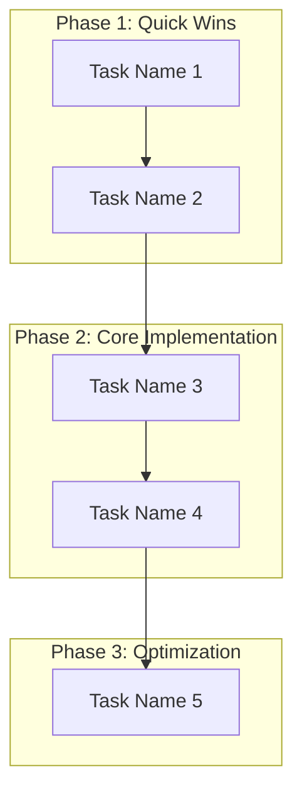

## 📋 Task Management Workflow
### NOTE: For every task, if i ask you "Tell me what should i do ?" or something like wanting you to plan for doing something. You ALWAYS need to create Task.md first before doing anything after.

### Task.md Template

```markdown
# Project: [Project Name]

## 🎯 Current State
- **Phase**: [Current Phase]
- **Progress**: [X/Y tasks completed]
- **Next Goal**: [What we're working toward]

## ✅ Completed Tasks
- [x] Task 1 (completed date/time)
- [x] Task 2 (completed date/time)

## 🔄 Pending Tasks
### Phase 1: Quick Wins (HIGH PRIORITY)
- [ ] Task Name (X minutes)
  - **Objective**: [Brief description of what to achieve]
  - **Why?**: [Purpose and impact]
  - **Files to modify**: [Specific file paths]
  - **Dependencies**: [Prerequisites]
  - **Inputs & Outputs**: [Data inputs and expected outputs]
  - **Acceptance Criteria**: [Conditions that must be met for completion]
  - **Definition of Done**: [Explicit checklist for done]
  - **Test Cases**: [How to verify correctness]

### Phase 2: Core Implementation (HIGH PRIORITY)
- [ ] Task Name (X minutes)
  - **Objective**: [Brief description]
  - **Why?**: [Purpose and impact]
  - **Files to modify**: [Specific file paths]
  - **Dependencies**: [Prerequisites]
  - **Inputs & Outputs**: [Data inputs and expected outputs]
  - **Acceptance Criteria**: [Conditions that must be met for completion]
  - **Definition of Done**: [Explicit checklist for done]
  - **Test Cases**: [How to verify correctness]

### Phase 3: Optimization (MEDIUM PRIORITY)
- [ ] Task Name (X minutes)
  - **Objective**: [Brief description]
  - **Why?**: [Purpose and impact]
  - **Files to modify**: [Specific file paths]
  - **Dependencies**: [Prerequisites]
  - **Inputs & Outputs**: [Data inputs and expected outputs]
  - **Acceptance Criteria**: [Conditions that must be met for completion]
  - **Definition of Done**: [Explicit checklist for done]
  - **Test Cases**: [How to verify correctness]

### Phase 4: Advanced Features (LOW PRIORITY)
- [ ] Task Name (X minutes)
  - **Objective**: [Brief description]
  - **Why?**: [Purpose and impact]
  - **Files to modify**: [Specific file paths]
  - **Dependencies**: [Prerequisites]
  - **Inputs & Outputs**: [Data inputs and expected outputs]
  - **Acceptance Criteria**: [Conditions that must be met for completion]
  - **Definition of Done**: [Explicit checklist for done]
  - **Test Cases**: [How to verify correctness]

## 📊 Workflow Visualization

```
# Planning Guide for AI Assistant

## 🎯 Core Philosophy: Systematic Planning Approach

When a user asks for planning help or says "I don't know what to do next", follow this systematic approach:

### Phase 1: Understand Current State
1.  **Analyze Codebase Structure**
    -   Use `list_dir` to understand the project structure.
    -   Use `semantic_search` or `grep_search` to locate relevant components and identify incomplete implementations.

2.  **Identify Gaps & Issues**
    -   Look for `TODO` or `FIXME` comments.
    -   Check for commented-out configurations.
    -   Find missing implementations or broken dependencies by analyzing build or test errors.

### Phase 2: Systematic Problem Analysis
1.  **Break Down the Problem**
    -   Break down complex problems into logical, sequential steps.
    -   Identify dependencies between tasks.
    -   Prioritize based on impact and effort.

2.  **Research Best Practices**
    -   Use `fetch_webpage` to research external documentation, tutorials, and best practices.

### Phase 3: Create Actionable Plan
1.  **Structure the Plan**
    -   Break the plan into phases with clear priorities (e.g., Quick Wins, Core Implementation, Optimization).
    -   Estimate the effort for each task.
    -   Identify potential risks and dependencies.

2.  **Provide Multiple Options**
    -   Give the user choices between different approaches when applicable.
    -   Explain the pros and cons of each option.

## 📋 Standard Planning Workflow

### Step 1: Context Loading & Analysis
```typescript
// Understand what exists
list_dir({ path: "./", recursive: true });
semantic_search({ query: "relevant components for the feature" });
grep_search({ query: "TODO|FIXME", isRegexp: true });
```

### Step 2: Research & Validation
```typescript
// Get external knowledge if needed
fetch_webpage({ urls: ["https://example.com/docs/relevant-topic"], query: "best practices for specific task" });
```

### Step 3: Plan Creation
```typescript
// Create a structured plan in a markdown file
create_file({
    filePath: "Task.md",
    content: `
# Plan
## Phase 1: Quick Wins
- [ ] Task 1 (5 minutes)
...
`
});
```

### Step 4: Review & Confirm Plan
-   **Action**: Explicitly ask the user for confirmation.
-   **Example Prompt**: "Here is the proposed plan. Does this look good to you? Are there any adjustments you'd like to make before we proceed?"
-   **Goal**: Ensure alignment before creating tasks.

## 🎪 Planning Patterns for Common Scenarios

### Scenario 1: "I don't know what to do next"
1.  **Analyze current state** → Find incomplete implementations using `grep_search` for `pass`, `TODO`.
2.  **Identify quick wins** → Tasks that can be completed quickly.
3.  **Prioritize by impact** → What will move the project forward most.
4.  **Provide clear next steps** → Specific, actionable tasks.

### Scenario 2: "Help me plan this feature"
1.  **Understand requirements** → What does the user want to achieve?
2.  **Analyze existing patterns** → How is similar functionality implemented? Use `semantic_search`.
3.  **Research best practices** → What are the recommended approaches? Use `fetch_webpage`.
4.  **Create implementation plan** → Step-by-step with dependencies.

### Scenario 3: "Debug this issue"
1.  **Reproduce the problem** → Understand what's broken. Ask user for steps or run tests.
2.  **Analyze error context** → Use `get_errors` to find related code and dependencies.
3.  **Research solutions** → Look for similar issues and fixes online.
4.  **Plan fix strategy** → Systematic approach to resolution.

## 📊 Planning Output Format

### Standard Response Structure
```
## 🎯 Understanding (Current State)
- What I found in the codebase.
- Key components and their status.
- Identified gaps and issues.

## 💡 Insights (Analysis)
- What this means for the project.
- Dependencies and relationships.
- Potential risks or considerations.

## 🚀 Plan (Actionable Steps)
### Phase 1: Quick Wins (HIGH PRIORITY)
- [ ] Task 1 (5 minutes)
- [ ] Task 2 (10 minutes)

## 🎯 Next Steps
- Specific actions to take immediately.
- Tools to use for each step.
- Success criteria for completion.
```

## 🔧 Planning Best Practices

### Do's
- ✅ Always start by understanding the project context.
- ✅ Break complex problems into smaller steps.
- ✅ Provide multiple options when appropriate.
- ✅ Estimate effort and prioritize tasks.
- ✅ Consider dependencies between tasks.

### Don'ts
- ❌ Don't assume the user knows the codebase.
- ❌ Don't give vague, high-level advice.
- ❌ Don't ignore existing patterns in the codebase.

## 📋 Task Management Workflow

### Task Creation (After Planning)
When a plan is approved, create or update a `Task.md` file.

### Task Update Workflow
When user says "cập nhật task":

1.  **Read current `Task.md`** to understand the current state.
2.  **Update completed tasks** based on the user's progress.
3.  **Update pending tasks** with new priorities if needed.
4.  **Write updated `Task.md`** with current progress.
5.  **Provide next immediate actions**.