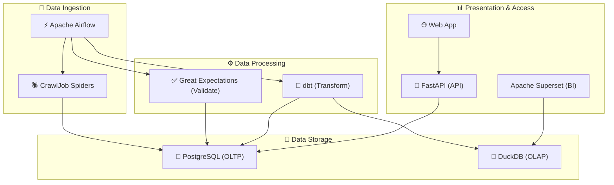

# CrawlJob - Professional Data Engineering Project 🎉

Hệ thống kỹ thuật dữ liệu chuyên nghiệp để thu thập, kiểm tra chất lượng, biến đổi và trực quan hóa dữ liệu việc làm từ **10 trang tuyển dụng hàng đầu Việt Nam**. Dự án này không chỉ là một công cụ scraping mà còn là một pipeline dữ liệu hoàn chỉnh, sẵn sàng cho các tác vụ phân tích và học máy.

## 🏗️ Kiến trúc Hệ thống

Dự án được xây dựng theo kiến trúc hiện đại, tách biệt rõ ràng các thành phần, bao gồm:
- **Thu thập dữ liệu (Ingestion)**: `Scrapy` & `Selenium` & `BeautifulSoup`
- **Điều phối (Orchestration)**: `Apache Airflow`
- **Lưu trữ (Storage)**: `PostgreSQL` (OLTP) & `DuckDB` (OLAP)
- **Kiểm tra chất lượng (Data Quality)**: `Great Expectations`
- **Biến đổi dữ liệu (Transformation)**: `dbt`
- **API & Giao diện (Presentation)**: `FastAPI` & `Vanilla JS`
- **Trực quan hóa (BI)**: `Apache Superset`



## 🚀 Bắt đầu nhanh (Getting Started)

### Yêu cầu
- Python 3.10+
- Docker & Docker Compose
- Git

### Cài đặt & Cấu hình

Thực hiện các bước sau theo đúng thứ tự để cài đặt môi trường development.

**1. Clone Repository**
```bash
git clone <your-repository-url>
cd CrawlJob
```

**2. Tạo và kích hoạt Môi trường ảo**
```bash
# Tạo môi trường ảo
python -m venv .venv

# Kích hoạt (Windows)
.\.venv\Scripts\activate
```

**3. Cài đặt các gói phụ thuộc**
```bash
pip install -r requirements.txt
```

**4. Cấu hình Biến môi trường**
Copy file `.env.example` thành file `.env` và điền các thông tin cần thiết.
```bash
# Windows
copy .env.example .env
```
Sau đó, mở file `.env` và điền thông tin đăng nhập PostgreSQL, tài khoản ITviec, LinkedIn, v.v.

**5. Khởi động Database**
Dự án sử dụng PostgreSQL chạy trong Docker. Hãy khởi động container:
```bash
docker-compose up -d
```
Lệnh này sẽ khởi động một service PostgreSQL có thể truy cập tại `localhost:5432`.

```
Lệnh này sẽ hỏi bạn một vài câu, hãy nhấn `Enter` để chấp nhận các giá trị mặc định.

**6. Chạy thử nghiệm**
Bây giờ bạn đã sẵn sàng! Hãy thử chạy một spider để kiểm tra:
```bash
python run_spider.py --spider itviec --keyword "Data Engineer"
```
Dữ liệu sẽ được thu thập và lưu vào database PostgreSQL của bạn.

## 📖 Hướng dẫn sử dụng

### Chạy Spiders
Sử dụng script `run_spider.py` để thực thi việc thu thập dữ liệu.

```bash
# Chạy một spider cụ thể
python run_spider.py --spider topcv --keyword "Product Manager"

# Chạy tất cả 10 spiders
python run_spider.py --spider all --keyword "IT"
```

### Chạy API Server
API cung cấp dữ liệu đã thu thập cho giao diện web.
```bash
uvicorn api.main:app --reload --host 0.0.0.0 --port 8000
```
- **Health check**: `http://localhost:8000/health`
- **Tìm kiếm jobs**: `http://localhost:8000/jobs?keyword=python`

### Kiểm tra chất lượng dữ liệu (Data Quality) (Great Expectations)
Sau khi thu thập dữ liệu, bạn có thể chạy quy trình kiểm tra chất lượng đã được định nghĩa.
```bash
# Lệnh này sẽ được tích hợp vào Airflow trong pipeline hoàn chỉnh
python validation/run_checkpoint.py <tên_checkpoint>
```

## 🛠️ Công nghệ sử dụng

- **Scrapy & Selenium**: Lõi thu thập dữ liệu, với khả năng vượt qua Cloudflare.
- **PostgreSQL & Docker**: Lưu trữ dữ liệu thô, dễ dàng cài đặt và quản lý.
- **Great Expectations**: Đảm bảo tính toàn vẹn và chất lượng của dữ liệu.
- **FastAPI**: Xây dựng API hiệu năng cao.
- **Và các công cụ khác trong DE Stack**: Airflow, dbt, DuckDB, Superset.

## 🤝 Đóng góp
Nếu bạn có ý tưởng cải thiện dự án, đừng ngần ngại tạo Pull Request hoặc mở một Issue.
