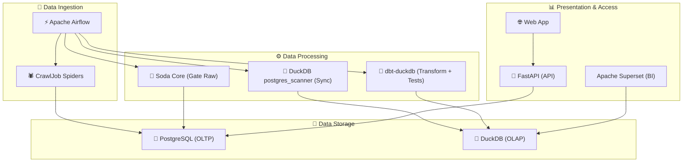

# CrawlJob - Professional Data Engineering Project 🎉

Hệ thống kỹ thuật dữ liệu chuyên nghiệp để thu thập, kiểm tra chất lượng, biến đổi và trực quan hóa dữ liệu việc làm từ **10 trang tuyển dụng hàng đầu Việt Nam**. Dự án này không chỉ là một công cụ scraping mà còn là một pipeline dữ liệu hoàn chỉnh, sẵn sàng cho các tác vụ phân tích và học máy.

## 🏗️ Kiến trúc Hệ thống

Dự án được xây dựng theo kiến trúc hiện đại, tách biệt rõ ràng các thành phần, bao gồm:
- **Thu thập dữ liệu (Ingestion)**: `Scrapy` & `Selenium` & `BeautifulSoup`
- **Điều phối (Orchestration)**: `Apache Airflow`
- **Lưu trữ (Storage)**: `PostgreSQL` (OLTP) & `DuckDB` (OLAP)
- **Kiểm tra chất lượng (Data Quality)**: `Soda Core` (Raw gating) + `dbt tests` (Business rules)
- **Đồng bộ Postgres → DuckDB (EL)**: `DuckDB postgres_scanner` (không cần Docker/Airbyte)
- **Biến đổi dữ liệu (Transformation)**: `dbt-duckdb` (biến đổi trong DuckDB)
- **API & Giao diện (Presentation)**: `FastAPI` & `Vanilla JS`
- **Trực quan hóa (BI)**: `Apache Superset`

## 📊 Tình trạng Dự án Hiện tại
- Đã hoàn thành việc chuyển dữ liệu lên PostgreSQL Supabase