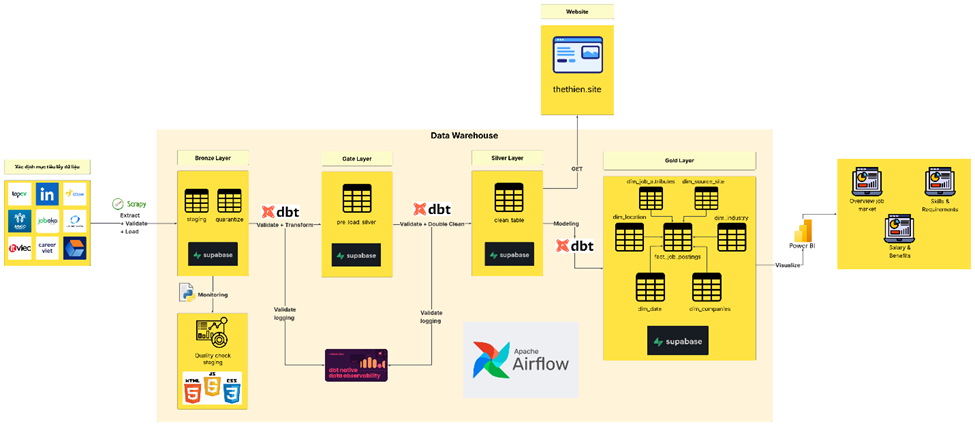

# CrawlJob — End-to-End Job Market Data Pipeline

> Thu thập dữ liệu tuyển dụng đa nguồn bằng Scrapy, chuẩn hóa bằng dbt theo Medallion, và điều phối bằng Airflow.

## Tổng quan
CrawlJob là pipeline ETL dành cho thị trường tuyển dụng Việt Nam, tập trung vào:
- Crawl dữ liệu từ nhiều nền tảng tuyển dụng (Scrapy + Selenium/undetected-chromedriver)
- Lưu dữ liệu thô vào PostgreSQL (staging) và tách dữ liệu lỗi (quarantine)
- Chuẩn hóa, kiểm thử và mô hình hóa dữ liệu bằng dbt
- Giám sát chất lượng dữ liệu với Elementary + báo cáo HTML
- Phục vụ BI qua Power BI dashboard

## Kiến trúc tổng thể hệ thống:


## Tech Stack
- **Scraping:** Scrapy, Selenium, undetected-chromedriver
- **Orchestration:** Apache Airflow 2.9.3 (Docker)
- **Transform & Test:** dbt-postgres 1.9.1, Elementary 0.20.1
- **Storage:** PostgreSQL 15 (On Supabase)
- **BI:** Power BI (`dashboard/analysis_dashboard.pbix`)

## Cấu trúc thư mục chính
```
CrawlJob/                 # Scrapy project (spiders, items, pipelines)
airflow/dags/             # DAG orchestration
scripts/extract_and_load/ # Run spider (CLI)
scripts/transform/        # dbt project (silver, gold, tests)
scripts/quality_check/    # Quality check report (HTML)
dashboard/                # Power BI + HTML reports
config/                   # SQL scripts + paths
docs/                     # Documentation
```


## Thiết lập nhanh (2 lựa chọn)

### Lựa chọn A — Docker + Airflow (khuyến nghị)
**Ưu:** đầy đủ pipeline, tái lập dễ, chạy như production.  
**Nhược:** tốn tài nguyên hơn.

1) Tạo `.env` từ `env.example` và sửa lại thông tin kết nối:
   - Ở project này, tôi có sử dụng Supabase để lưu trữ dữ liệu. Còn nếu các bạn không dùng Supabase thì có thể tận dụng PostgreSQL container đã có sẵn mà có cài đặt để lưu metadata cho airflow. Bạn có thể tận dụng nó để lưu dữ liệu cũng được với cấu hình như sau:
     - `POSTGRES_HOST=postgres`
     - `POSTGRES_USER=airflow`
     - `POSTGRES_PASSWORD=airflow`
     - `POSTGRES_DB=airflow`  
   

2) Build & chạy:
```
docker-compose up -d --build
```

3) Truy cập Airflow UI: `http://localhost:8080`  
Tài khoản mặc định: `admin / admin`

### Lựa chọn B — Local (Scrapy + dbt) (Không khuyến nghị nhưng vẫn có thể sử dụng)
**Ưu:** nhanh, dễ debug.  
**Nhược:** không có orchestration tự động.

1) Tạo môi trường Python và cài dependencies:
```
python -m venv .venv
.\.venv\Scripts\activate
python -m pip install -r requirements.txt
```

2) Tạo `.env` (tối thiểu `POSTGRES_*` và các credential nếu cần)

3) Chạy spider:
```
python -m scripts.extract_and_load.run_spider --spider topcv --keyword data
```

4) Chạy dbt:
```
cd scripts/transform
dbt deps
dbt test --select source:scrapy_raw.staging_jobs --profiles-dir profiles
dbt run --select int_jobs_cleaned --profiles-dir profiles
dbt test --select int_jobs_cleaned --profiles-dir profiles
dbt run --select silver_jobs+ --profiles-dir profiles
```

## Chạy spider (CLI)
```
python -m scripts.extract_and_load.run_spider \
  --spider <jobsgo|joboko|123job|careerviet|linkedin|topcv|itviec|careerlink|all|local_version|githubactions_version> \
  --keyword data \
  --output jobs.json
```
Gợi ý:
- `local_version` mặc định chạy `linkedin` + `topcv`
- `all` sẽ chạy toàn bộ các spider chính

## Orchestration (Airflow DAG)
DAG: `crawl_and_transform_pipeline`  
Lịch chạy: `0 15 * * *` (15:00 hàng ngày, Asia/Ho_Chi_Minh) (Bạn có thể sửa lại lịch chạy theo nhu cầu của bạn)

Chuỗi nhiệm vụ chính:
1) Extract & Load (Scrapy)
2) dbt test nguồn `staging_jobs`
3) dbt run `int_jobs_cleaned`
4) dbt test `int_jobs_cleaned`
5) Quality check
6) Elementary report
7) dbt run `silver_jobs+`

## Data Quality
- **dbt tests:** khai báo trong `scripts/transform/models/sources.yml`
- **Elementary report:** `scripts/transform/edr_target/elementary_report.html`
- **HTML dashboard quality:** chạy:
```
python -m scripts.quality_check.staging_check
```
Kết quả ở: `dashboard/quality_check_report.html`

## Dashboard
- Power BI: `dashboard/analysis_dashboard.pbix`
- Báo cáo chất lượng: `dashboard/quality_check_report.html`

## Cấu hình môi trường (`.env`)
```
POSTGRES_HOST=...
POSTGRES_PORT=...
POSTGRES_DB=...
POSTGRES_USER=...
POSTGRES_PASSWORD=...
ITVIEC_EMAIL=...
ITVIEC_PASS=...
LINKEDIN_EMAIL=...
LINKEDIN_PASS=...
```
Khuyến nghị dùng account test (account mới lập/không sử dụng) để tránh rủi ro khóa tài khoản khi crawl.

## LƯU Ý
- Folder .github/workflows/ chỉ dùng để chạy pipeline trên Github Actions, không dùng để chạy pipeline trên local. Tôi hiện vẫn giữ lại vì chưa có server để deploy pipeline.