# CrawlJob - Professional Data Engineering Project 🎉

Hệ thống kỹ thuật dữ liệu chuyên nghiệp để thu thập, kiểm tra chất lượng, biến đổi và trực quan hóa dữ liệu việc làm từ **10 trang tuyển dụng hàng đầu Việt Nam**. Dự án này không chỉ là một công cụ scraping mà còn là một pipeline dữ liệu hoàn chỉnh, sẵn sàng cho các tác vụ phân tích và học máy.

## 🏗️ Kiến trúc Hệ thống

Dự án được xây dựng theo kiến trúc hiện đại, tách biệt rõ ràng các thành phần, bao gồm:
- **Thu thập dữ liệu (Ingestion)**: `Scrapy` & `Selenium` & `BeautifulSoup`
- **Điều phối (Orchestration)**: `Apache Airflow`
- **Lưu trữ (Storage)**: `PostgreSQL` (OLTP) & `DuckDB` (OLAP)
- **Kiểm tra chất lượng (Data Quality)**: `Soda Core` (Raw gating) + `dbt tests` (Business rules)
- **Biến đổi dữ liệu (Transformation)**: `dbt-duckdb` (biến đổi trong DuckDB)
- **API & Giao diện (Presentation)**: `FastAPI` & `Vanilla JS`
- **Trực quan hóa (BI)**: `Apache Superset`

```mermaid
flowchart TD
    subgraph ingestion["🔄 Data Ingestion"]
        spiders["🕷️ CrawlJob Spiders"]
        airflow["⚡ Apache Airflow"]
    end
    subgraph storage["💾 Data Storage"]
        postgres["🐘 PostgreSQL (OLTP)"]
        duckdb["🦆 DuckDB (OLAP)"]
    end
    subgraph processing["⚙️ Data Processing"]
        soda["🧪 Soda Core (Gate Raw)"]
        airbyte["🧲 Airbyte (Sync Postgres → DuckDB)"]
        dbt["🔨 dbt-duckdb (Transform + Tests)"]
    end
    subgraph presentation["📊 Presentation & Access"]
        superset["Apache Superset (BI)"]
        fastapi["🚀 FastAPI (API)"]
        webapp["🌐 Web App"]
    end
    airflow --> spiders --> postgres
    airflow --> soda --> postgres
    airflow --> airbyte --> duckdb
    airflow --> dbt
    dbt --> duckdb
    fastapi --> postgres
    webapp --> fastapi
    superset --> duckdb
```



## 🚀 Bắt đầu nhanh (Getting Started)

### Yêu cầu
- Python 3.10+
- Docker & Docker Compose
- Git

### Cài đặt & Cấu hình

Thực hiện các bước sau theo đúng thứ tự để cài đặt môi trường development.

**1. Clone Repository**
```bash
git clone <your-repository-url>
cd CrawlJob
```

**2. Tạo và kích hoạt Môi trường ảo**
```bash
# Tạo môi trường ảo
python -m venv .venv

# Kích hoạt (Windows)
.\.venv\Scripts\activate
```

**3. Cài đặt các gói phụ thuộc**
```bash
pip install -r requirements.txt
```

**4. Cấu hình Biến môi trường**
Copy file `.env.example` thành file `.env` và điền các thông tin cần thiết.
```bash
# Windows
copy .env.example .env
```
Sau đó, mở file `.env` và điền thông tin đăng nhập PostgreSQL, tài khoản ITviec, LinkedIn, v.v.

**5. Khởi động Database**
Dự án sử dụng PostgreSQL chạy trong Docker. Hãy khởi động container:
```bash
docker-compose up -d
```
Lệnh này sẽ khởi động một service PostgreSQL có thể truy cập tại `localhost:5432`.

```
Lệnh này sẽ hỏi bạn một vài câu, hãy nhấn `Enter` để chấp nhận các giá trị mặc định.

**6. Chạy thử nghiệm**
Bây giờ bạn đã sẵn sàng! Hãy thử chạy một spider để kiểm tra:
```bash
python run_spider.py --spider itviec --keyword "Data Engineer"
```
Dữ liệu sẽ được thu thập và lưu vào database PostgreSQL của bạn.

### Cấu trúc thư mục chi tiết

```
CrawlJob/
├── .env.example              # Template cho biến môi trường
├── .gitignore                # Các file và thư mục được Git bỏ qua
├── api/
│   └── main.py               # API Server (FastAPI)
├── CrawlJob/                 # Source code chính của Scrapy
│   ├── spiders/              # Chứa 10 spiders cho các trang web
│   ├── items.py              # Định nghĩa cấu trúc dữ liệu JobItem
│   ├── pipelines.py          # Xử lý và lưu trữ dữ liệu vào PostgreSQL
│   └── settings.py           # Cấu hình của Scrapy
├── airflow/                  # Airflow DAGs (pipeline orchestration)
│   └── dags/
│       └── crawljob_pipeline.py
├── soda/                     # Data Quality (Raw Gating with Soda Core)
│   ├── configuration.yml     # Kết nối Postgres (dùng .env)
│   └── checks/
│       └── raw_jobs.yml      # Kiểm tra bảng raw
├── debug/                    # Các script hỗ trợ debug
├── docker-compose.yml        # Định nghĩa các service Docker (PostgreSQL)
├── plan/                     # Các tài liệu kế hoạch
│   └── DATA_ENGINEERING_STACK_PLAN.md
├── README.md                 # Tài liệu hướng dẫn dự án
├── requirements.txt          # Các gói Python cần thiết
├── run_spider.py             # Script để chạy các spiders từ command line
├── scrapy.cfg                # Cấu hình dự án Scrapy
├── test/                     # Các file và script để test
└── web/                      # Giao diện Frontend (HTML, CSS, JS)
    ├── css/
    ├── js/
    └── index.html
```

## 📖 Hướng dẫn sử dụng

### Chạy Spiders
Sử dụng script `run_spider.py` để thực thi việc thu thập dữ liệu.

```bash
# Chạy một spider cụ thể
python run_spider.py --spider topcv --keyword "Product Manager"

# Chạy tất cả 10 spiders
python run_spider.py --spider all --keyword "IT"
```

### Chạy API Server
API cung cấp dữ liệu đã thu thập cho giao diện web.
```bash
uvicorn api.main:app --reload --host 0.0.0.0 --port 8000
```
- **Health check**: `http://localhost:8000/health`
- **Tìm kiếm jobs**: `http://localhost:8000/jobs?keyword=python`

### Kiểm tra chất lượng dữ liệu (Data Quality)
Áp dụng mô hình kiểm tra hai lớp + đồng bộ:

- Lớp 1 (Raw Gating - Soda Core): kiểm tra bảng `raw` ngay sau khi crawl để đảm bảo dữ liệu sẵn sàng.
```bash
# Ví dụ (chạy thủ công)
soda scan -d job_database -c soda/configuration.yml soda/checks/raw_jobs_check1.yml
soda scan -d job_database -c soda/configuration.yml soda/checks/raw_jobs_check2.yml
soda scan -d job_database -c soda/configuration.yml soda/checks/raw_jobs_check3.yml
```

- Đồng bộ (EL) sang DuckDB: dùng Airbyte để sync từ PostgreSQL → DuckDB trước khi transform.
- Lớp 2 (Business Validation - dbt tests): chạy các kiểm tra cho các model sau khi `dbt run` trong DuckDB.
```bash
# Ví dụ với dbt-duckdb
cd path/to/dbt_duckdb_project
 dbt run && dbt test
```

## 🛠️ Công nghệ sử dụng

- **Scrapy & Selenium**: Lõi thu thập dữ liệu, với khả năng vượt qua Cloudflare.
- **PostgreSQL & Docker**: Lưu trữ dữ liệu thô, dễ dàng cài đặt và quản lý.
- **Soda Core + dbt tests**: Đảm bảo tính toàn vẹn và chất lượng dữ liệu (raw + transformed).
- **FastAPI**: Xây dựng API hiệu năng cao.
- **Và các công cụ khác trong DE Stack**: Airflow, dbt, DuckDB, Superset.

## 🤝 Đóng góp
Nếu bạn có ý tưởng cải thiện dự án, đừng ngần ngại tạo Pull Request hoặc mở một Issue.
