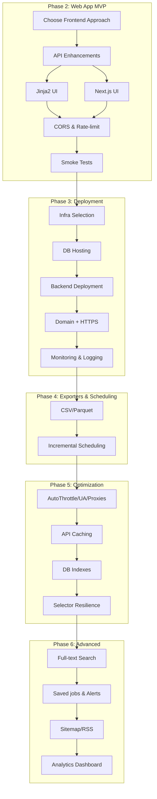

# Project: CrawlJob

## 🎯 Current State
- **Phase**: Phase 2 in progress (FastAPI completed)
- **Progress**: 9/12 tasks completed
- **Next Goal**: Public web app (search UI) and deployment

## ✅ Completed Tasks
- [x] Implement spiders: JobsGO, JobOKO, 123job, CareerViet
- [x] SQL Server pipeline: create table if missing, insert items
- [x] CLI runner `run_spider.py` with FEEDS to export JSON
- [x] Environment-based DB configuration via `.env` (python-dotenv)
- [x] Basic throttling config and custom User-Agent
- [x] Dedup & Unique Constraint — unique on `(source_site, job_url)`; prevent duplicates (completed)
- [x] Upsert (Insert-or-Update) + `updated_at` — update existing rows and set `updated_at` (completed)
- [x] Structured Logging (được chủ dự án xác nhận bỏ qua và coi như hoàn tất)
- [x] API Read-Only Service (FastAPI) — implemented with /health and /jobs endpoints (completed)

## 🔄 Pending Tasks
### Phase 2: Web App MVP (HIGH PRIORITY)
- [ ] Frontend approach decision (15 minutes)
  - **Objective**: Chọn A hoặc B
  - **Option A (khuyến nghị nhanh)**: FastAPI + Jinja2 SSR (đơn giản, 1 repo, SEO ổn)
  - **Option B**: Next.js (SSR) ở thư mục `web/`, tách frontend/backend, UX tốt hơn
  - **Acceptance Criteria**: Ghi rõ lựa chọn vào README, cập nhật plan bên dưới tương ứng

- [ ] Backend API enhancements (45 minutes)
  - **Objective**: Bổ sung filter/sort cho web: `site`, `location`, `job_type`, `experience_level`, `date_range`, sort theo `updated_at/created_at`
  - **Files to modify**: `api/main.py`
  - **Acceptance Criteria**: `/jobs` hỗ trợ các query mới; tài liệu query trong README

- [ ] Web UI (Option A - Jinja2) (1.5 hours)
  - **Objective**: Tạo giao diện cơ bản: Trang chủ (search), Trang kết quả, Trang chi tiết
  - **Files to modify**: `api/templates/` (`base.html`, `index.html`, `results.html`, `job.html`), `api/main.py` route render templates
  - **Acceptance Criteria**: Tìm kiếm được; phân trang; filter theo site/location; SEO meta cơ bản
  - **Test Cases**: Truy cập trang chủ, nhập từ khóa, thấy kết quả phân trang

- [ ] Web UI (Option B - Next.js) (3 hours)
  - **Objective**: Tạo app `web/` (Next.js), trang chủ + kết quả + chi tiết
  - **Files to modify**: `web/` mới; fetch API từ `api/`
  - **Acceptance Criteria**: Tìm kiếm/Phân trang/Filter hoạt động; SEO cơ bản

- [ ] CORS + basic rate-limit (30 minutes)
  - **Objective**: Cho phép frontend truy cập API, hạn chế abuse đơn giản
  - **Files to modify**: `api/main.py` (CORS middleware); README (origin cấu hình)
  - **Acceptance Criteria**: CORS pass; rate-limit tối thiểu ở cấp reverse proxy hoặc app

- [ ] Smoke tests UI (30 minutes)
  - **Objective**: Kiểm thử flow tìm kiếm end-to-end
  - **Acceptance Criteria**: 3 ca kiểm thử tay: keyword phổ biến, filter site, chuyển trang

### Phase 3: Deployment (HIGH PRIORITY)
- [ ] Infra selection (15 minutes)
  - **Objective**: Chọn nơi host: Render/Azure App Service/Railway
  - **Acceptance Criteria**: Ghi rõ trong README + file `deploy/README.md`

- [ ] Database hosting (45 minutes)
  - **Objective**: Sử dụng Azure SQL (khuyến nghị) hoặc SQL Server tự host; đặt IP/firewall
  - **Acceptance Criteria**: API kết nối được DB public qua ENV; không commit secrets

- [ ] Backend deployment (45 minutes)
  - **Objective**: Deploy FastAPI (uvicorn) lên cloud
  - **Files**: `deploy/` hướng dẫn; config ENV
  - **Acceptance Criteria**: `/health` public 200 OK; `/jobs` trả dữ liệu

- [ ] Domain + HTTPS (30 minutes)
  - **Objective**: Gắn domain và SSL
  - **Acceptance Criteria**: Truy cập domain HTTPS chạy OK

- [ ] Monitoring & logging (30 minutes)
  - **Objective**: Bật access/error logs, health check monitor
  - **Acceptance Criteria**: Có log lưu; health check cảnh báo được (tối thiểu manual)

### Phase 4: Exporters & Scheduling (MEDIUM PRIORITY)
- [ ] Exporters: CSV/Parquet (45 minutes)
  - **Objective**: Hỗ trợ xuất CSV/Parquet ngoài JSON
  - **Files to modify**: `run_spider.py` (`--output-format`), README
  - **Acceptance Criteria**: Xuất file `.csv`/`.parquet` với schema ổn định

- [ ] Incremental Crawling & Scheduling (1 hour)
  - **Objective**: Lập lịch chạy (Windows Task Scheduler) và chỉ crawl job mới/cập nhật
  - **Acceptance Criteria**: Lên lịch định kỳ; log cho mỗi lần chạy; dữ liệu tăng hợp lý

### Phase 5: Optimization (MEDIUM PRIORITY)
- [ ] AutoThrottle & Rotating User-Agent/Proxies (1.5 hours)
- [ ] API caching (Redis hoặc in-memory cho top query) (1 hour)
- [ ] DB indexes & query tuning (45 minutes)
- [ ] Selector resilience (1.5 hours)

### Phase 6: Advanced Features (LOW PRIORITY)
- [ ] Full-text search (SQL Server Full-Text) (2 hours)
- [ ] Saved jobs & email alerts (2 hours)
- [ ] Sitemap/RSS for SEO (45 minutes)
- [ ] Analytics Dashboard integration (2 hours)

## 📊 Workflow Visualization

## 🎯 Next Actions
1. Quyết định frontend (Option A: Jinja2 SSR — nhanh; Option B: Next.js — giàu UX)
2. Bổ sung filter/sort cho `/jobs` phục vụ UI
3. Khởi tạo UI tương ứng (templates hoặc Next.js app)

## 📊 Progress Tracking
- **Total tasks**: 20
- **Completed**: 9
- **Remaining**: 11
- **Estimated time**: ~12–15 hours (tuỳ Option A/B)

## 🎯 Success Criteria
- [ ] Người dùng có thể tìm kiếm công việc, lọc, phân trang trên web công khai
- [ ] Triển khai public với HTTPS + domain
- [ ] Tối thiểu 3 minutes MTTR nhờ log/monitoring
- [ ] Không rò rỉ secrets; dùng ENV ở server
