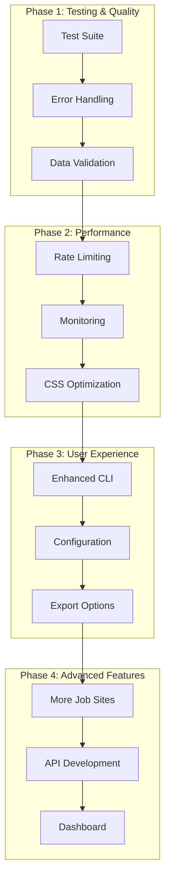

# Project: CrawlJob - Job Scraping System

## 🎯 Current State
- **Phase**: Basic Implementation Complete
- **Progress**: Core functionality working, needs enhancement
- **Next Goal**: Improve reliability, testing, and user experience

## ✅ Completed Tasks
- [x] Basic Scrapy project structure (completed)
- [x] JobsGO spider implementation (completed)
- [x] TopCV spider implementation (completed)
- [x] SQL Server database pipeline (completed)
- [x] Command-line interface (completed)

## 🔄 Pending Tasks

### Phase 1: Testing & Quality Assurance (HIGH PRIORITY)
- [ ] **Implement Test Suite** (2 hours)
  - **Objective**: Create comprehensive test coverage for spiders and pipelines
  - **Why?**: Ensure reliability and prevent regressions
  - **Files to modify**: Create `tests/` directory, `tests/test_spiders.py`, `tests/test_pipelines.py`
  - **Dependencies**: pytest, scrapy-testing
  - **Inputs & Outputs**: Mock responses, expected job data
  - **Acceptance Criteria**: 80%+ test coverage, all critical paths tested
  - **Definition of Done**: Tests pass, coverage report generated
  - **Test Cases**: Spider parsing, data validation, database operations

- [ ] **Add Error Handling & Logging** (1.5 hours)
  - **Objective**: Improve error recovery and debugging capabilities
  - **Why?**: Better user experience and easier troubleshooting
  - **Files to modify**: `CrawlJob/spiders/*.py`, `CrawlJob/pipelines.py`, `run_spider.py`
  - **Dependencies**: None
  - **Inputs & Outputs**: Enhanced error messages, detailed logs
  - **Acceptance Criteria**: Graceful handling of network errors, database issues
  - **Definition of Done**: No unhandled exceptions, informative error messages
  - **Test Cases**: Network failures, database connection issues, invalid data

- [ ] **Data Validation Enhancement** (1 hour)
  - **Objective**: Improve data quality and validation
  - **Why?**: Ensure reliable and clean job data
  - **Files to modify**: `CrawlJob/items.py`, `CrawlJob/pipelines.py`
  - **Dependencies**: None
  - **Inputs & Outputs**: Raw scraped data, validated job items
  - **Acceptance Criteria**: All required fields validated, data cleaning applied
  - **Definition of Done**: Comprehensive data validation, cleaning rules
  - **Test Cases**: Invalid data handling, field validation, data transformation

### Phase 2: Performance & Reliability (HIGH PRIORITY)
- [ ] **Implement Rate Limiting & Retry Logic** (2 hours)
  - **Objective**: Add intelligent rate limiting and retry mechanisms
  - **Why?**: Prevent blocking and improve success rate
  - **Files to modify**: `CrawlJob/settings.py`, `CrawlJob/middlewares.py`
  - **Dependencies**: None
  - **Inputs & Outputs**: Request configuration, retry policies
  - **Acceptance Criteria**: Configurable delays, automatic retries, respect robots.txt
  - **Definition of Done**: Rate limiting middleware, retry logic, configuration options
  - **Test Cases**: Rate limiting behavior, retry on failures, respect site policies

- [ ] **Add Monitoring & Metrics** (1.5 hours)
  - **Objective**: Implement performance monitoring and statistics
  - **Why?**: Track performance and identify issues
  - **Files to modify**: `CrawlJob/settings.py`, `CrawlJob/pipelines.py`, `run_spider.py`
  - **Dependencies**: None
  - **Inputs & Outputs**: Performance metrics, statistics reports
  - **Acceptance Criteria**: Request counts, success rates, timing data
  - **Definition of Done**: Performance dashboard, statistics collection
  - **Test Cases**: Metrics accuracy, performance tracking

- [ ] **Optimize CSS Selectors** (1 hour)
  - **Objective**: Improve selector reliability and efficiency
  - **Why?**: Better data extraction and fewer failures
  - **Files to modify**: `CrawlJob/spiders/jobsgo_spider.py`, `CrawlJob/spiders/topcv_spider.py`
  - **Dependencies**: None
  - **Inputs & Outputs**: Updated selectors, improved extraction
  - **Acceptance Criteria**: Higher success rate, more accurate data extraction
  - **Definition of Done**: Robust selectors with multiple fallbacks
  - **Test Cases**: Selector reliability, data extraction accuracy

### Phase 3: User Experience & Features (MEDIUM PRIORITY)
- [ ] **Enhanced CLI Interface** (1.5 hours)
  - **Objective**: Improve command-line user experience
  - **Why?**: Better usability and more features
  - **Files to modify**: `run_spider.py`
  - **Dependencies**: None
  - **Inputs & Outputs**: Enhanced CLI with progress bars, better output
  - **Acceptance Criteria**: Progress indicators, better error messages, help text
  - **Definition of Done**: User-friendly CLI with comprehensive help
  - **Test Cases**: CLI functionality, help system, error handling

- [ ] **Add Configuration Management** (1 hour)
  - **Objective**: Implement flexible configuration system
  - **Why?**: Easy customization without code changes
  - **Files to modify**: `CrawlJob/settings.py`, create `config.yaml`
  - **Dependencies**: pyyaml
  - **Inputs & Outputs**: Configuration files, flexible settings
  - **Acceptance Criteria**: Environment-based config, easy customization
  - **Definition of Done**: Config file support, environment variables
  - **Test Cases**: Configuration loading, environment overrides

- [ ] **Implement Data Export Options** (1 hour)
  - **Objective**: Add multiple export formats
  - **Why?**: Flexibility for different use cases
  - **Files to modify**: `CrawlJob/pipelines.py`, `run_spider.py`
  - **Dependencies**: None
  - **Inputs & Outputs**: CSV, Excel, JSON export options
  - **Acceptance Criteria**: Multiple export formats, configurable output
  - **Definition of Done**: CSV, Excel, JSON export capabilities
  - **Test Cases**: Export functionality, format validation

### Phase 4: Advanced Features (LOW PRIORITY)
- [ ] **Add More Job Sites** (3 hours)
  - **Objective**: Expand to additional Vietnamese job sites
  - **Why?**: More comprehensive job data coverage
  - **Files to modify**: Create new spider files, update `run_spider.py`
  - **Dependencies**: Analysis of new sites
  - **Inputs & Outputs**: New spider implementations
  - **Acceptance Criteria**: 2-3 additional job sites supported
  - **Definition of Done**: New spiders working, integrated into CLI
  - **Test Cases**: New spider functionality, data quality

- [ ] **Implement Job Search API** (4 hours)
  - **Objective**: Create REST API for job search
  - **Why?**: Enable web/mobile applications
  - **Files to modify**: Create `api/` directory, new API files
  - **Dependencies**: FastAPI or Flask
  - **Inputs & Outputs**: REST API endpoints, JSON responses
  - **Acceptance Criteria**: Search API, filtering, pagination
  - **Definition of Done**: Working API with documentation
  - **Test Cases**: API functionality, response validation

- [ ] **Add Job Analytics Dashboard** (5 hours)
  - **Objective**: Create web dashboard for job data analysis
  - **Why?**: Visualize job market trends
  - **Files to modify**: Create `dashboard/` directory, web interface
  - **Dependencies**: Streamlit or Dash
  - **Inputs & Outputs**: Interactive web dashboard
  - **Acceptance Criteria**: Charts, filters, job market insights
  - **Definition of Done**: Working dashboard with visualizations
  - **Test Cases**: Dashboard functionality, data visualization

## 📊 Workflow Visualization

## 🎯 Next Actions
1. **Immediate**: Start with Phase 1 - implement test suite
2. **Tools needed**: pytest, scrapy-testing, logging configuration
3. **Success criteria**: Reliable, well-tested scraping system

## 📊 Progress Tracking
- **Total tasks**: 12
- **Completed**: 5
- **Remaining**: 7
- **Estimated time**: 20-25 hours

## 🎯 Success Criteria
- [ ] Comprehensive test coverage (80%+)
- [ ] Robust error handling and logging
- [ ] High-performance scraping with rate limiting
- [ ] User-friendly CLI with multiple export options
- [ ] Extensible architecture for new job sites
- [ ] Production-ready deployment capabilities