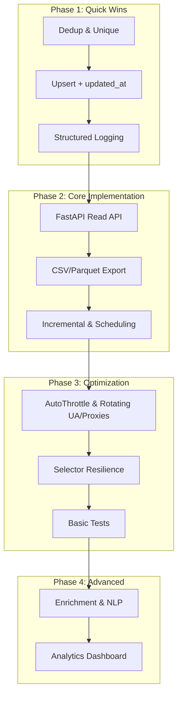

# Project: CrawlJob

## 🎯 Current State
- **Phase**: Data acquisition complete (MVP scrapers working)
- **Progress**: 7/12 tasks completed
- **Next Goal**: API access for consumers, reliability/ops improvements

## ✅ Completed Tasks
- [x] Implement spiders: JobsGO, JobOKO, 123job, CareerViet
- [x] SQL Server pipeline: create table if missing, insert items
- [x] CLI runner `run_spider.py` with FEEDS to export JSON
- [x] Environment-based DB configuration via `.env` (python-dotenv)
- [x] Basic throttling config and custom User-Agent
- [x] Dedup & Unique Constraint — unique on `(source_site, job_url)`; prevent duplicates (completed)
- [x] Upsert (Insert-or-Update) + `updated_at` — update existing rows and set `updated_at` (completed)

## 🔄 Pending Tasks
### Phase 1: Quick Wins (HIGH PRIORITY)
- [ ] Structured Logging (30 minutes)
  - **Objective**: Thêm logging chuẩn (level, context `spider`, `job_url`).
  - **Why?**: Dễ theo dõi lỗi và chất lượng crawl.
  - **Files to modify**: Các spider, `pipelines.py`.
  - **Acceptance Criteria**: Log có đủ thông tin, ghi ra file `logs/`.
  - **Test Cases**: Chạy 1 spider và kiểm tra file log.

### Phase 2: Core Implementation (HIGH PRIORITY)
- [ ] API Read-Only Service (FastAPI) (2 hours)
  - **Objective**: Cung cấp endpoint tìm kiếm job theo `keyword`, `location`, `source_site`.
  - **Why?**: Cho phép ứng dụng/đối tác tiêu thụ dữ liệu qua HTTP.
  - **Files to modify**: Thư mục `api/` mới (`main.py`), thêm deps: `fastapi`, `uvicorn`.
  - **Acceptance Criteria**: 
    - GET `/jobs?keyword=...&site=...` trả JSON (paging).
    - Kết nối SQL Server read-only, filter cơ bản, sort theo `created_at`.
  - **Test Cases**: Gọi API trả danh sách, status 200, thời gian phản hồi < 500ms nội bộ.

- [ ] Exporters: CSV/Parquet (45 minutes)
  - **Objective**: Hỗ trợ xuất CSV/Parquet ngoài JSON.
  - **Why?**: Linh hoạt tích hợp BI/ML.
  - **Files to modify**: `run_spider.py` (tham số `--output-format`), README.
  - **Acceptance Criteria**: Tạo được file `.csv`/`.parquet` với schema ổn định.
  - **Test Cases**: So sánh số bản ghi giữa DB và file export.

- [ ] Incremental Crawling & Scheduling (1 hour)
  - **Objective**: Lập lịch chạy (Windows Task Scheduler) và chỉ crawl job mới/cập nhật.
  - **Why?**: Duy trì dữ liệu cập nhật theo ngày/giờ.
  - **Files to modify**: README hướng dẫn lập lịch; spider chấp nhận tham số `since` (nếu cần).
  - **Acceptance Criteria**: Lên lịch chạy định kỳ; crawl ít dữ liệu dư thừa.
  - **Test Cases**: Lên lịch chạy thử, kiểm tra log và số bản ghi tăng hợp lý.

### Phase 3: Optimization (MEDIUM PRIORITY)
- [ ] AutoThrottle & Rotating User-Agent/Proxies (1.5 hours)
  - **Objective**: Giảm rate-limit/ràng buộc bot.
  - **Why?**: Ổn định crawl khi quy mô lớn.
  - **Files to modify**: `settings.py` (AutoThrottle), middleware UA/proxy.
  - **Acceptance Criteria**: Giảm lỗi 429/ban; tốc độ crawl ổn định.
  - **Test Cases**: So sánh thời gian/ lỗi trước-sau.

- [ ] Selector Resilience (1.5 hours)
  - **Objective**: Chuẩn hoá selector theo module và fallback đa chiến lược.
  - **Why?**: Giảm vỡ khi HTML thay đổi nhỏ.
  - **Files to modify**: `spiders/` (trích chung hàm extract, regex labels), `utils.py`.
  - **Acceptance Criteria**: 90% trang thay đổi nhẹ vẫn parse được các trường chính.
  - **Test Cases**: Bộ trang mẫu (cũ/mới) parse ổn.

- [ ] Basic Tests (1 hour)
  - **Objective**: Thêm unit test cho utils và pipeline; fake HTML cho parser.
  - **Why?**: Bảo vệ chức năng cốt lõi.
  - **Files to modify**: `tests/` mới; CI cân nhắc sau.
  - **Acceptance Criteria**: `pytest` pass; coverage tối thiểu cho utils/pipeline.

### Phase 4: Advanced Features (LOW PRIORITY)
- [ ] Enrichment & NLP (4 hours)
  - **Objective**: Chuẩn hoá trường (mức lương, địa điểm), trích kỹ năng, phân loại ngành.
  - **Why?**: Tăng giá trị phân tích downstream.
  - **Files to modify**: Module `enrichment/` (chuẩn hoá, mapping, NLP cơ bản), thêm cột mới nếu cần.
  - **Acceptance Criteria**: Tỷ lệ parse chuẩn hoá >80% cho mẫu thử.

- [ ] Analytics Dashboard (2 hours)
  - **Objective**: Metabase/PowerBI/Streamlit dashboard nhanh.
  - **Why?**: Trực quan hoá số liệu.
  - **Files to modify**: Tài liệu cấu hình + script kết nối.
  - **Acceptance Criteria**: Xem được top công ty, mức lương theo vị trí.

## 📊 Workflow Visualization

## 🎯 Next Actions
1. Structured Logging (thêm logger chuẩn và ghi file dưới `logs/`)
2. Thiết kế API đọc (FastAPI) để truy vấn jobs
3. Bật AutoThrottle và chuẩn bị chiến lược UA/Proxy nếu mở rộng

## 📊 Progress Tracking
- **Total tasks**: 12
- **Completed**: 7
- **Remaining**: 5
- **Estimated time**: ~11.5 hours

## 🎯 Success Criteria
- [ ] Không còn trùng lặp theo `job_url` sau nhiều lần crawl
- [ ] Có API read-only để tiêu thụ dữ liệu
- [ ] Crawl ổn định với AutoThrottle và UA/Proxy
- [ ] Có test cơ bản bảo vệ pipeline và utils
