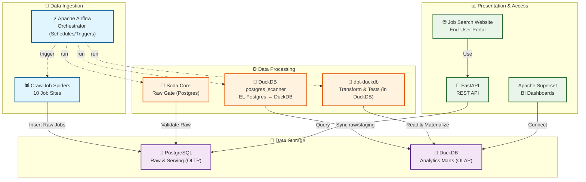
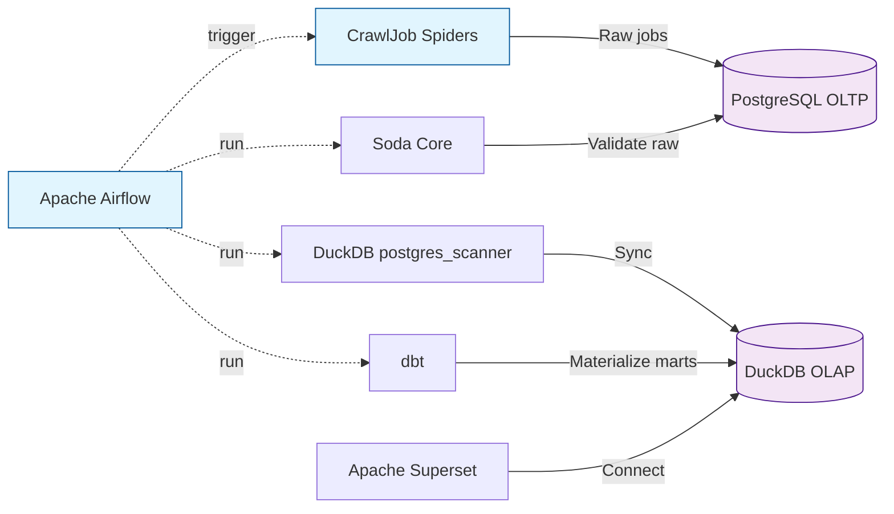
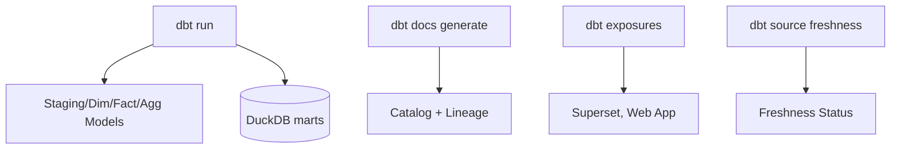
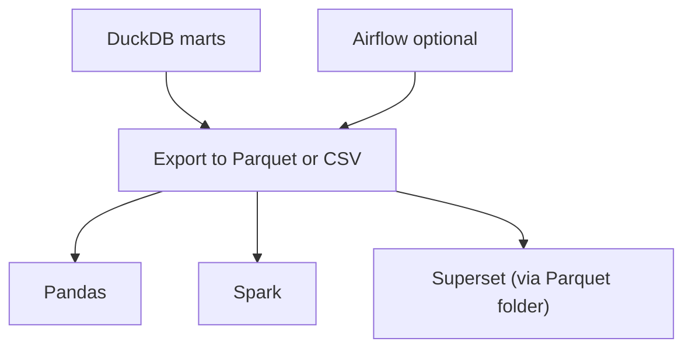

# 🚀 **DATA ENGINEERING STACK IMPLEMENTATION PLAN**
## **CrawlJob: Professional Data Engineering Project**

---

## 📋 **TABLE OF CONTENTS**

1. [🎯 Project Overview](#-project-overview)
2. [🏗️ Architecture Design](#️-architecture-design)
3. [📚 Documentation References](#-documentation-references)

---

## 📚 **DOCUMENTATION REFERENCES**

### **Detailed Architecture Documents**
- 📐 **[Data Warehouse Architecture](DATA_WAREHOUSE_ARCHITECTURE.md)**: 
  - Complete Bronze-Silver-Gold layer design
  - Star Schema with Fact & Dimension tables
  - SCD (Slowly Changing Dimensions) implementation
  - Query patterns and use cases
  - Performance optimization strategies

- 📊 **[SCD Guide](../learning/data-warehouse-scd-guide.md)**:
  - SCD Types 0-6 explained with examples
  - When to use each type
  - dbt implementation patterns
  - CrawlJob-specific SCD mapping

### **Learning Resources**
- 🔨 [dbt Introduction](../learning/dbt-introduction.md)
- 📝 [dbt Testing Guide](../learning/dbt-testing-guide.md)
- 🦆 [DuckDB Guideline](../learning/duckdb-guideline.md)

---

## 🎯 **PROJECT OVERVIEW**

### **Current Status**
- ✅ **10 Spiders** hoạt động hoàn hảo
- ✅ **PostgreSQL** database với 10,000+ records
- ✅ **FastAPI** backend với REST endpoints
- ✅ **Web Dashboard** với Bootstrap 5
- ✅ **Automated daily crawling**

### **Data Engineering Goal**
Chuyển đổi CrawlJob thành **Professional Data Engineering Project** với:
- **Apache Airflow**: Workflow orchestration
- **dbt**: Data transformation layer
- **Soda Core + dbt tests**: Data quality validation (Raw Gate + Business Rules)
– **Apache Superset**: Data visualization và analytics

### **Benefits**
- 🏢 **Professional**: Industry-standard data engineering stack
- 📊 **Advanced Analytics**: Rich dashboards và insights
- 🔧 **Automation**: Fully automated pipelines
- 📈 **Scalability**: Easy to scale as project grows
- 💼 **Career Growth**: Valuable skills for data engineering

---

## 🏗️ **ARCHITECTURE DESIGN**

### **Current Architecture**
```
CrawlJob Spiders → PostgreSQL → FastAPI → Web Dashboard
```

### **Target Data Engineering Architecture**

#### **Detailed Data Flow**



#### Data Flow chi tiết cho Apache Superset

1) Điều phối theo lịch (Airflow)
- Airflow chạy theo lịch (ví dụ 02:00 hằng ngày) và lần lượt trigger các bước: chạy spiders → kiểm tra chất lượng (Soda Core) → đồng bộ EL (DuckDB postgres_scanner: PostgreSQL → DuckDB) → biến đổi dữ liệu (dbt-duckdb) → cập nhật kho OLAP (DuckDB).

2) Thu thập dữ liệu (Spiders → PostgreSQL)
- Các spiders thu thập dữ liệu từ 10 trang, chuẩn hóa tối thiểu và ghi trực tiếp vào PostgreSQL (schema/raw), kèm timestamps/metadata phục vụ kiểm soát phiên crawl.

3) Kiểm tra chất lượng (Raw Gate – Soda Core)
- Soda Core chạy trên bảng raw ở PostgreSQL: kiểm tra schema, tính hợp lệ (URL), không null, row_count, và freshness (scraped_at).
- Nếu FAIL: Airflow dừng pipeline, gửi cảnh báo; dữ liệu OLAP cũ vẫn được giữ nguyên để dashboard Superset không bị ảnh hưởng.
- Nếu PASS: tiếp tục bước biến đổi. (Sau-transform) Sử dụng `dbt test` để kiểm tra các model.

4) Đồng bộ dữ liệu (DuckDB postgres_scanner – EL)
- DuckDB `postgres_scanner` sync từ PostgreSQL (raw/staging) → DuckDB (OLAP), hỗ trợ full refresh hoặc incremental theo cột thời gian (mặc định `scraped_at`).
- Quản lý lịch chạy và tham số hoá qua Airflow (BashOperator).

5) Biến đổi dữ liệu (dbt-duckdb – ELT)
- dbt-duckdb đọc dữ liệu trong DuckDB → tạo các mô hình staging/dim/fact/agg.
- Kết quả được materialize trực tiếp trong DuckDB thành các bảng/khung nhìn analytics-ready.

5) Kho phân tích (DuckDB – OLAP)
- DuckDB lưu trữ các mô hình phục vụ phân tích (ví dụ: dim_companies, fct_jobs, agg_jobs_by_industry…).
- File DuckDB được đặt tại một đường dẫn ổn định để phục vụ kết nối từ Superset.

6) Kết nối Apache Superset
- Superset kết nối tới DuckDB qua SQLAlchemy (duckdb-engine) để đọc các bảng phân tích. Ví dụ kết nối:
    - SQLAlchemy URI: `duckdb:///D:/path/to/warehouse.duckdb`

7) Làm mới dữ liệu (Refresh)
- Desktop: Refresh thủ công để phát triển/kiểm thử.
- Service: Dùng cron Airflow để trigger sync + transform; dashboard dùng nguồn DuckDB cập nhật.

8) Trình bày và tiêu thụ
- Superset sử dụng các bảng trong DuckDB để dựng dashboard (Jobs by Industry, Salary Distribution, Trends…). Người dùng xem dashboard trên giao diện Superset.

9) Ứng dụng web người dùng
- Job Search Website truy cập dữ liệu qua FastAPI → PostgreSQL (OLTP) để phục vụ tra cứu/tìm kiếm theo thời gian thực; không truy vấn DuckDB.



#### Data Flow chi tiết cho Orchestration & Monitoring (Airflow)

1) Lên lịch & điều phối
- Airflow DAG chạy theo cron (ví dụ 02:00). Các task: `run_spiders` → `soda_validate_raw` → `duckdb_sync` → `dbt_run` → `dbt_test` → `notify_success`.

2) Retry & SLA
- Mỗi task có `retries` và `retry_delay` hợp lý; đặt `sla` để cảnh báo khi quá thời gian.

3) Logging & Artifacts
- Log chi tiết của từng task được lưu vào thư mục logs; artifacts gồm log `soda scan`, file DuckDB, và dbt target (manifest/run_results).

4) Alerting
- Kênh cảnh báo: Email/Slack khi task fail/SLA miss.

5) Observability
- Theo dõi trạng thái DAG trên Airflow UI (Gantt/Graph).

#### Data Quality Implementation (Soda Core + dbt tests)

1) Soda Core (Raw Gate)
- Khai báo data source Postgres trong `soda/configuration.yml`.
- Định nghĩa checks trong `soda/checks/raw_jobs_check1.yml`, `raw_jobs_check2.yml`, `raw_jobs_check3.yml`.
- Chạy tuần tự 3 checks trong Airflow (BashOperator). Fail dừng pipeline.

2) dbt tests (Post-Transform)
- Viết tests trong `schema.yml` của các model (built-in + dbt-expectations nếu cần).
- Chạy `dbt test` sau `dbt run`. Fail thì alert và dừng publish.

#### EL Implementation (DuckDB postgres_scanner)

- Script: `scripts/sync_pg_to_duckdb.py`
- Env vars:
  - `POSTGRES_HOST, POSTGRES_PORT, POSTGRES_DB, POSTGRES_USER, POSTGRES_PASSWORD`
  - `DUCKDB_PATH`, `DUCKDB_SCHEMA` (default: `raw`)
  - `PG_TABLE` (default: `jobs`), `PG_CURSOR_COLUMN` (default: `scraped_at`)
  - `SYNC_MODE` = `full` | `incremental` (default: `incremental`)
- Full refresh:
```bash
set SYNC_MODE=full & python scripts/sync_pg_to_duckdb.py
```
- Incremental:
```bash
python scripts/sync_pg_to_duckdb.py
```

#### Data Flow chi tiết cho dbt Docs & Lineage



#### Data Flow chi tiết cho Data Export/Sharing (Parquet/External)

1) Export từ DuckDB
- Sau `dbt run`, có thể export bảng phân tích từ DuckDB sang Parquet/CSV trong `data/exports/` để chia sẻ cho data science/đối tác.

2) Tích hợp công cụ khác
- Các công cụ như Pandas, Spark, hoặc Power BI (qua Parquet folder) có thể tiêu thụ dữ liệu này mà không cần truy cập trực tiếp DB.

3) Quản trị phiên bản
- Đặt quy tắc đặt tên (kèm timestamp) và dọn dẹp phiên bản cũ bằng job định kỳ để tối ưu dung lượng.



### **Technology Stack**
- **Orchestration**: Apache Airflow
- **OLTP Database**: PostgreSQL
- **OLAP Database**: DuckDB
- **Transformation**: dbt-duckdb
- **EL**: DuckDB postgres_scanner script
- **Data Quality**: Soda Core (raw) + dbt tests (post-transform)
- **Visualization**: Apache Superset
- **Backend**: FastAPI
- **Frontend**: Bootstrap 5
- **Containerization**: Docker
- **Version Control**: Git & GitHub
