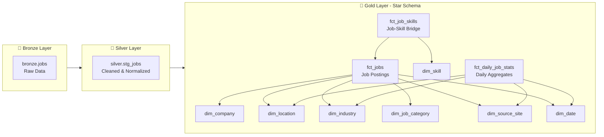
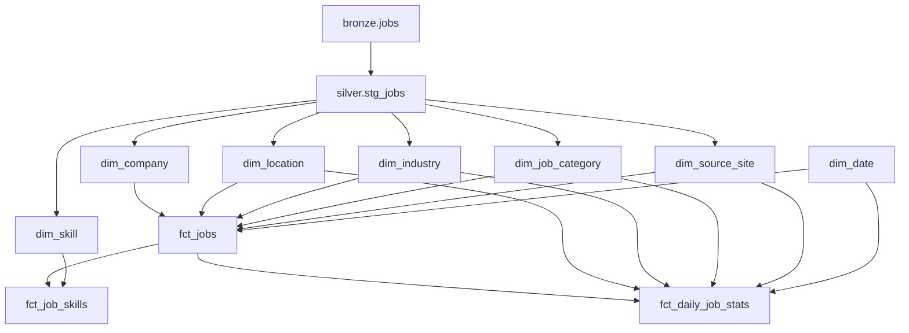

# 🏛️ **DATA WAREHOUSE ARCHITECTURE - CrawlJob**

## 📋 **Table of Contents**

1. [Overview](#overview)
2. [Architecture Design](#architecture-design)
3. [Bronze Layer](#bronze-layer)
4. [Silver Layer](#silver-layer)
5. [Gold Layer](#gold-layer)
6. [Data Flow](#data-flow)
7. [Use Cases](#use-cases)

---

## 🎯 **Overview**

### **Modeling Approach**
- **Framework**: Kimball Dimensional Modeling (Star Schema)
- **Architecture**: Bronze-Silver-Gold (Medallion Architecture)
- **Storage**: DuckDB (OLAP-optimized)
- **Transformation**: dbt-duckdb

### **Key Principles**
1. **Separation of Concerns**: Raw → Cleaned → Analytics
2. **Star Schema**: Optimized for BI queries
3. **Incremental Processing**: Efficient with large datasets
4. **SCD Support**: Track historical changes
5. **Conformed Dimensions**: Reusable across fact tables

---

## 🏗️ **Architecture Design**



---

## 🥉 **Bronze Layer - Raw Data**

### **Purpose**
- Store raw data exactly as extracted from PostgreSQL
- No transformations, just archive
- Enable reprocessing if needed

### **Table: `bronze.jobs`**

```sql
CREATE TABLE bronze.jobs (
    -- Raw fields (no transformations)
    job_title           TEXT,
    company_name        TEXT,
    salary              TEXT,
    location            TEXT,
    job_type            TEXT,
    experience_level    TEXT,
    education_level     TEXT,
    job_industry        TEXT,
    job_position        TEXT,
    job_description     TEXT,
    requirements        TEXT,
    benefits            TEXT,
    job_deadline        TEXT,
    source_site         TEXT,
    job_url             TEXT,
    search_keyword      TEXT,
    scraped_at          TIMESTAMP,
    
    -- Metadata
    _loaded_at          TIMESTAMP DEFAULT CURRENT_TIMESTAMP,
    _source             VARCHAR DEFAULT 'postgres_sync'
);
```

### **Loading Strategy**
- **Method**: Incremental MERGE (via `sync_pg_to_duck/sync.py`)
- **Frequency**: Daily (after Scrapy crawl)
- **Deduplication**: By (job_url, scraped_at)
- **Retention**: Keep all historical data

---

## 🥈 **Silver Layer - Cleaned & Normalized**

### **Purpose**
- Clean, validate, and normalize raw data
- Standardize formats and values
- Extract derived fields
- Data quality checks

### **Table: `silver.stg_jobs`**

```sql
CREATE TABLE silver.stg_jobs (
    -- Primary Key
    job_url             VARCHAR,
    scraped_date        DATE,
    
    -- Normalized Fields
    job_title           VARCHAR,
    company_name        VARCHAR,      -- Lowercased, trimmed
    salary              VARCHAR,
    location            VARCHAR,
    
    -- Parsed Salary Components
    salary_min          DECIMAL(12,2),
    salary_max          DECIMAL(12,2),
    salary_currency     VARCHAR(3),   -- VND, USD
    is_salary_negotiable BOOLEAN,
    
    -- Standardized Fields
    job_type            VARCHAR,      -- Normalized: Full-time, Part-time, etc.
    experience_level    VARCHAR,      -- Normalized: Entry, Junior, Mid, Senior
    education_level     VARCHAR,      -- Normalized: Bachelor, Master, PhD
    job_industry        VARCHAR,
    job_position        VARCHAR,
    
    -- Extracted Features
    skills_extracted    JSON,         -- Array of skills from description
    is_remote           BOOLEAN,      -- Detected from description
    is_urgent           BOOLEAN,      -- Detected from title/description
    
    -- Rich Text (cleaned)
    job_description     TEXT,
    requirements        TEXT,
    benefits            TEXT,
    
    -- Dates
    job_deadline        DATE,
    scraped_at          TIMESTAMP,
    
    -- Source
    source_site         VARCHAR,
    search_keyword      VARCHAR,
    
    -- Quality Flags
    has_salary          BOOLEAN,
    has_description     BOOLEAN,
    has_requirements    BOOLEAN,
    is_valid            BOOLEAN,      -- Passed all quality checks
    
    -- Metadata
    _processed_at       TIMESTAMP DEFAULT CURRENT_TIMESTAMP,
    
    PRIMARY KEY (job_url, scraped_date)
);
```

### **Transformations Applied**
1. **Text Cleaning**: Trim, lowercase, remove special characters
2. **Salary Parsing**: Extract min/max/currency from text
3. **Standardization**: Map to controlled vocabularies
4. **Skill Extraction**: NLP-based extraction from descriptions
5. **Feature Engineering**: Derive boolean flags
6. **Date Parsing**: Convert text to proper dates
7. **Validation**: Apply business rules

### **dbt Model Example**
```sql
-- models/silver/stg_jobs.sql
{{
  config(
    materialized='incremental',
    unique_key=['job_url', 'scraped_date']
  )
}}

SELECT
    job_url,
    CAST(scraped_at AS DATE) AS scraped_date,
    
    -- Normalize company name
    LOWER(TRIM(company_name)) AS company_name,
    
    -- Parse salary
    CAST(REGEXP_EXTRACT(salary, '(\d+)') AS DECIMAL) AS salary_min,
    
    -- Standardize job type
    CASE
        WHEN LOWER(job_type) LIKE '%full%' THEN 'Full-time'
        WHEN LOWER(job_type) LIKE '%part%' THEN 'Part-time'
        WHEN LOWER(job_type) LIKE '%contract%' THEN 'Contract'
        ELSE 'Other'
    END AS job_type,
    
    -- Feature flags
    CASE 
        WHEN LOWER(job_description) LIKE '%remote%' 
          OR LOWER(job_description) LIKE '%work from home%' 
        THEN TRUE 
        ELSE FALSE 
    END AS is_remote,
    
    *
FROM {{ source('bronze', 'jobs') }}


    WHERE scraped_at > (SELECT MAX(scraped_at) FROM {{ this }})

```

---

## 🥇 **Gold Layer - Analytics-Ready (Star Schema)**

### **Purpose**
- Optimized for analytics and BI
- Dimensional modeling (Star Schema)
- Historical tracking (SCD)
- Pre-aggregated metrics

---

## 📊 **FACT TABLES**

### **1. `fct_jobs` - Core Fact Table** ⭐

**Purpose**: Job posting transactions

```sql
CREATE TABLE gold.fct_jobs (
    -- Surrogate Key
    job_sk              BIGINT PRIMARY KEY,
    
    -- Business Key
    job_url             VARCHAR NOT NULL,
    
    -- Foreign Keys (Dimensions)
    company_sk          BIGINT NOT NULL,     -- → dim_company
    location_sk         BIGINT NOT NULL,     -- → dim_location
    industry_sk         BIGINT,              -- → dim_industry
    job_category_sk     BIGINT NOT NULL,     -- → dim_job_category
    source_site_sk      BIGINT NOT NULL,     -- → dim_source_site
    scraped_date_sk     INTEGER NOT NULL,    -- → dim_date
    deadline_date_sk    INTEGER,             -- → dim_date
    
    -- Degenerate Dimensions (low cardinality, no separate table needed)
    job_title           VARCHAR NOT NULL,
    job_description     TEXT,
    requirements        TEXT,
    benefits            TEXT,
    search_keyword      VARCHAR,
    
    -- Measures (Numeric Metrics)
    salary_min          DECIMAL(12,2),
    salary_max          DECIMAL(12,2),
    salary_avg          DECIMAL(12,2),       -- (min + max) / 2
    salary_currency     VARCHAR(3),
    
    -- Additive Flags (for COUNT aggregations)
    has_salary          BOOLEAN,
    is_salary_negotiable BOOLEAN,
    is_remote           BOOLEAN,
    is_urgent           BOOLEAN,
    is_active           BOOLEAN,
    
    -- Audit Columns
    created_at          TIMESTAMP DEFAULT CURRENT_TIMESTAMP,
    updated_at          TIMESTAMP DEFAULT CURRENT_TIMESTAMP,
    
    -- Indexes
    INDEX idx_company (company_sk),
    INDEX idx_location (location_sk),
    INDEX idx_scraped_date (scraped_date_sk),
    INDEX idx_source (source_site_sk)
);
```

**Key Design Decisions**:
- ✅ Surrogate keys for all dimensions
- ✅ Date dimension keys (INTEGER YYYYMMDD format)
- ✅ Degenerate dimensions for text fields
- ✅ Pre-calculated salary_avg for performance
- ✅ Boolean flags for easy aggregation

---

### **2. `fct_job_skills` - Bridge Table** (Many-to-Many)

**Purpose**: Link jobs to skills with attributes

```sql
CREATE TABLE gold.fct_job_skills (
    -- Composite Key
    job_sk              BIGINT NOT NULL,     -- → fct_jobs
    skill_sk            BIGINT NOT NULL,     -- → dim_skill
    
    -- Attributes
    skill_level         VARCHAR,             -- Junior, Mid, Senior, Expert
    is_required         BOOLEAN,             -- Required vs Nice-to-have
    years_required      INTEGER,             -- Years of experience needed
    
    -- Audit
    created_at          TIMESTAMP DEFAULT CURRENT_TIMESTAMP,
    
    PRIMARY KEY (job_sk, skill_sk),
    FOREIGN KEY (job_sk) REFERENCES fct_jobs(job_sk),
    FOREIGN KEY (skill_sk) REFERENCES dim_skill(skill_sk)
);
```

**Use Cases**:
- Skills demand analysis
- Skill combinations (Python + AWS)
- Experience requirements by skill

---

### **3. `fct_daily_job_stats` - Aggregate Fact** (Snapshot)

**Purpose**: Pre-aggregated daily statistics for performance

```sql
CREATE TABLE gold.fct_daily_job_stats (
    -- Grain: Daily snapshot by dimensions
    date_sk             INTEGER NOT NULL,    -- → dim_date
    source_site_sk      BIGINT NOT NULL,     -- → dim_source_site
    location_sk         BIGINT,              -- → dim_location
    industry_sk         BIGINT,              -- → dim_industry
    job_category_sk     BIGINT,              -- → dim_job_category
    
    -- Metrics (Additive)
    total_jobs          INTEGER,
    new_jobs            INTEGER,             -- New this day
    expired_jobs        INTEGER,             -- Expired this day
    active_jobs         INTEGER,             -- Still accepting
    
    -- Salary Metrics (Semi-Additive)
    avg_salary          DECIMAL(12,2),
    median_salary       DECIMAL(12,2),
    p25_salary          DECIMAL(12,2),
    p75_salary          DECIMAL(12,2),
    min_salary          DECIMAL(12,2),
    max_salary          DECIMAL(12,2),
    
    -- Counts
    jobs_with_salary    INTEGER,
    jobs_remote         INTEGER,
    jobs_urgent         INTEGER,
    
    -- Metadata
    created_at          TIMESTAMP DEFAULT CURRENT_TIMESTAMP,
    
    PRIMARY KEY (date_sk, source_site_sk, COALESCE(location_sk, 0), 
                 COALESCE(industry_sk, 0), COALESCE(job_category_sk, 0))
);
```

**Benefits**:
- ⚡ Fast dashboard queries (pre-aggregated)
- 📈 Trend analysis ready
- 💾 Reduced query cost

---

## 🎨 **DIMENSION TABLES**

### **1. `dim_company` - Company Master** (SCD Type 2)

**Purpose**: Track company information over time

```sql
CREATE TABLE gold.dim_company (
    -- Surrogate Key
    company_sk          BIGINT PRIMARY KEY,
    
    -- Business Key
    company_name_raw    VARCHAR NOT NULL,    -- Original from source
    
    -- Attributes (Type 2: Track changes)
    company_name        VARCHAR NOT NULL,    -- Normalized name
    company_size        VARCHAR,             -- 1-50, 51-200, 201-500, 500+
    company_type        VARCHAR,             -- Startup, MNC, Local, Government
    industry_primary    VARCHAR,
    industry_secondary  VARCHAR,
    website             VARCHAR,
    description         TEXT,
    headquarters        VARCHAR,
    founded_year        INTEGER,
    
    -- SCD Type 2 Tracking
    effective_date      DATE NOT NULL,       -- Start of validity
    expiration_date     DATE,                -- End of validity (NULL = current)
    is_current          BOOLEAN NOT NULL DEFAULT TRUE,
    version_number      INTEGER DEFAULT 1,
    
    -- Audit
    created_at          TIMESTAMP DEFAULT CURRENT_TIMESTAMP,
    updated_at          TIMESTAMP DEFAULT CURRENT_TIMESTAMP,
    
    -- Natural key index
    INDEX idx_company_name (company_name),
    INDEX idx_current (is_current)
);
```

**SCD Type 2 Example**:
```sql
-- FPT Software grows from 200 → 500 employees
-- Old record
(1, 'FPT Software', 'FPT Software', '201-500', 'MNC', 'IT', ..., 
 '2024-01-01', '2024-06-30', FALSE, 1, ...)

-- New record (size changed)
(2, 'FPT Software', 'FPT Software', '500+', 'MNC', 'IT', ..., 
 '2024-07-01', NULL, TRUE, 2, ...)
```

---

### **2. `dim_location` - Hierarchical Location**

**Purpose**: Geographic dimensions with hierarchy

```sql
CREATE TABLE gold.dim_location (
    -- Surrogate Key
    location_sk         BIGINT PRIMARY KEY,
    
    -- Business Key
    location_raw        VARCHAR,             -- Original text
    
    -- Hierarchy (Vietnam specific)
    country             VARCHAR DEFAULT 'Vietnam',
    region              VARCHAR,             -- North, Central, South
    city                VARCHAR NOT NULL,    -- Hà Nội, TP.HCM, Đà Nẵng
    district            VARCHAR,             -- Quận/Huyện
    ward                VARCHAR,             -- Phường/Xã
    address_full        VARCHAR,
    
    -- Attributes
    city_code           VARCHAR(3),          -- HN, HCM, DN
    is_major_city       BOOLEAN,
    population          INTEGER,
    
    -- Geography
    latitude            DECIMAL(10,6),
    longitude           DECIMAL(10,6),
    
    -- Metadata
    created_at          TIMESTAMP DEFAULT CURRENT_TIMESTAMP
);
```

**Hierarchy Support**:
```
Country (Vietnam)
  └─ Region (North)
      └─ City (Hà Nội)
          └─ District (Ba Đình)
              └─ Ward (Điện Biên)
```

---

### **3. `dim_industry` - Industry Classification**

**Purpose**: Industry taxonomy (hierarchical)

```sql
CREATE TABLE gold.dim_industry (
    industry_sk         BIGINT PRIMARY KEY,
    
    -- Hierarchy (3 levels)
    industry_l1         VARCHAR NOT NULL,    -- Technology
    industry_l2         VARCHAR,             -- Software Development
    industry_l3         VARCHAR,             -- Web Development
    
    -- Attributes
    industry_code       VARCHAR,             -- NAICS/VSIC code
    description         TEXT,
    is_active           BOOLEAN DEFAULT TRUE,
    
    created_at          TIMESTAMP DEFAULT CURRENT_TIMESTAMP
);
```

**Example Records**:
```sql
(1, 'Technology', 'Software Development', 'Web Development', 'TECH-SW-WEB', ...)
(2, 'Technology', 'Software Development', 'Mobile Development', 'TECH-SW-MOB', ...)
(3, 'Technology', 'Data & Analytics', 'Data Engineering', 'TECH-DA-ENG', ...)
(4, 'Finance', 'Banking', 'Retail Banking', 'FIN-BK-RET', ...)
```

---

### **4. `dim_job_category` - Job Classification**

**Purpose**: Job titles, seniority, type classification

```sql
CREATE TABLE gold.dim_job_category (
    job_category_sk     BIGINT PRIMARY KEY,
    
    -- Hierarchy
    category_l1         VARCHAR NOT NULL,    -- Engineering
    category_l2         VARCHAR,             -- Software Engineering
    category_l3         VARCHAR,             -- Backend Engineer
    
    -- Seniority
    seniority_level     VARCHAR,             -- Entry, Junior, Mid, Senior, Lead, Manager
    seniority_order     INTEGER,             -- For ordering
    
    -- Job Type
    job_type            VARCHAR,             -- Full-time, Part-time, Contract, Intern
    
    -- Experience
    experience_years_min INTEGER,
    experience_years_max INTEGER,
    
    -- Education
    education_level     VARCHAR,             -- High School, Bachelor, Master, PhD
    education_required  BOOLEAN,
    
    -- Attributes
    description         TEXT,
    
    created_at          TIMESTAMP DEFAULT CURRENT_TIMESTAMP
);
```

---

### **5. `dim_skill` - Skills Master** (SCD Type 3)

**Purpose**: Technical and soft skills tracking

```sql
CREATE TABLE gold.dim_skill (
    skill_sk            BIGINT PRIMARY KEY,
    
    -- Business Key
    skill_name          VARCHAR UNIQUE NOT NULL,
    
    -- Hierarchy
    skill_category      VARCHAR NOT NULL,    -- Programming, Framework, Tool, Soft Skill
    skill_type          VARCHAR,             -- Hard Skill, Soft Skill
    skill_domain        VARCHAR,             -- Backend, Frontend, DevOps, Data
    
    -- Current Metrics (Type 1: Overwrite)
    popularity_score    INTEGER,             -- 0-100 based on frequency
    demand_trend        VARCHAR,             -- Rising, Stable, Declining
    
    -- Previous Metrics (Type 3: Limited history)
    previous_popularity_score INTEGER,
    previous_score_date       DATE,
    score_change_pct          DECIMAL(5,2),  -- % change
    
    -- Attributes
    is_technical        BOOLEAN,
    related_skills      JSON,                -- Array of related skill names
    
    -- Metadata
    created_at          TIMESTAMP DEFAULT CURRENT_TIMESTAMP,
    updated_at          TIMESTAMP DEFAULT CURRENT_TIMESTAMP
);
```

**SCD Type 3 Example**:
```sql
-- Python skill trending up
('Python', 'Programming Language', 'Hard Skill', 'Backend',
 95,  -- current popularity
 'Rising',
 85,  -- previous popularity
 '2024-09-01',
 +11.76  -- % change
)
```

---

### **6. `dim_source_site` - Job Boards** (SCD Type 1)

**Purpose**: Source website metadata

```sql
CREATE TABLE gold.dim_source_site (
    source_site_sk      BIGINT PRIMARY KEY,
    
    -- Business Key
    source_name         VARCHAR UNIQUE NOT NULL,
    
    -- Attributes (Type 1: Overwrite)
    source_url          VARCHAR,
    site_category       VARCHAR,             -- General, IT-focused, Executive
    country             VARCHAR DEFAULT 'Vietnam',
    language            VARCHAR DEFAULT 'Vietnamese',
    is_active           BOOLEAN DEFAULT TRUE,
    
    -- Quality Metrics (frequently updated)
    avg_data_quality    DECIMAL(3,2),        -- 0.00-1.00
    crawl_success_rate  DECIMAL(3,2),        -- 0.00-1.00
    last_crawl_date     DATE,
    total_jobs_crawled  INTEGER,
    
    -- Metadata
    created_at          TIMESTAMP DEFAULT CURRENT_TIMESTAMP,
    updated_at          TIMESTAMP DEFAULT CURRENT_TIMESTAMP
);
```

**Example Records**:
```sql
INSERT INTO dim_source_site VALUES
(1, 'itviec', 'https://itviec.com', 'IT-focused', 'Vietnam', 'English', TRUE, 0.95, 0.98, ...),
(2, 'topcv', 'https://topcv.vn', 'General', 'Vietnam', 'Vietnamese', TRUE, 0.92, 0.96, ...),
(3, 'vietnamworks', 'https://vietnamworks.com', 'General', 'Vietnam', 'Both', TRUE, 0.93, 0.97, ...);
```

---

### **7. `dim_date` - Date Dimension** (Type 0: Static)

**Purpose**: Standard date dimension for time-based analysis

```sql
CREATE TABLE gold.dim_date (
    -- Primary Key (YYYYMMDD format)
    date_sk             INTEGER PRIMARY KEY,
    
    -- Full Date
    full_date           DATE NOT NULL UNIQUE,
    
    -- Year Attributes
    year                INTEGER NOT NULL,
    year_name           VARCHAR,             -- '2025'
    
    -- Quarter Attributes
    quarter             INTEGER,             -- 1, 2, 3, 4
    quarter_name        VARCHAR,             -- 'Q1 2025'
    
    -- Month Attributes
    month               INTEGER,             -- 1-12
    month_name          VARCHAR,             -- 'January'
    month_short_name    VARCHAR,             -- 'Jan'
    year_month          VARCHAR,             -- '2025-01'
    
    -- Week Attributes
    week_of_year        INTEGER,             -- 1-53
    week_name           VARCHAR,             -- 'Week 1 2025'
    
    -- Day Attributes
    day_of_month        INTEGER,             -- 1-31
    day_of_week         INTEGER,             -- 1=Monday, 7=Sunday
    day_name            VARCHAR,             -- 'Monday'
    day_short_name      VARCHAR,             -- 'Mon'
    day_of_year         INTEGER,             -- 1-366
    
    -- Flags
    is_weekend          BOOLEAN,
    is_weekday          BOOLEAN,
    is_holiday          BOOLEAN,
    is_working_day      BOOLEAN,
    holiday_name        VARCHAR,
    
    -- Relative Flags
    is_today            BOOLEAN,
    is_yesterday        BOOLEAN,
    is_last_7_days      BOOLEAN,
    is_last_30_days     BOOLEAN,
    is_current_month    BOOLEAN,
    is_current_quarter  BOOLEAN,
    is_current_year     BOOLEAN,
    
    -- Fiscal Calendar (if different from calendar year)
    fiscal_year         INTEGER,
    fiscal_quarter      INTEGER,
    fiscal_month        INTEGER,
    
    created_at          TIMESTAMP DEFAULT CURRENT_TIMESTAMP
);
```

**Generation Script**:
```sql
-- Generate 10 years of dates
WITH RECURSIVE date_series AS (
    SELECT DATE '2020-01-01' AS full_date
    UNION ALL
    SELECT full_date + INTERVAL '1 day'
    FROM date_series
    WHERE full_date < DATE '2029-12-31'
)
INSERT INTO dim_date
SELECT
    CAST(TO_CHAR(full_date, 'YYYYMMDD') AS INTEGER) AS date_sk,
    full_date,
    EXTRACT(YEAR FROM full_date) AS year,
    CAST(EXTRACT(YEAR FROM full_date) AS VARCHAR) AS year_name,
    EXTRACT(QUARTER FROM full_date) AS quarter,
    'Q' || EXTRACT(QUARTER FROM full_date) || ' ' || EXTRACT(YEAR FROM full_date) AS quarter_name,
    EXTRACT(MONTH FROM full_date) AS month,
    TO_CHAR(full_date, 'Month') AS month_name,
    TO_CHAR(full_date, 'Mon') AS month_short_name,
    TO_CHAR(full_date, 'YYYY-MM') AS year_month,
    EXTRACT(WEEK FROM full_date) AS week_of_year,
    'Week ' || EXTRACT(WEEK FROM full_date) || ' ' || EXTRACT(YEAR FROM full_date) AS week_name,
    EXTRACT(DAY FROM full_date) AS day_of_month,
    EXTRACT(DOW FROM full_date) AS day_of_week,
    TO_CHAR(full_date, 'Day') AS day_name,
    TO_CHAR(full_date, 'Dy') AS day_short_name,
    EXTRACT(DOY FROM full_date) AS day_of_year,
    CASE WHEN EXTRACT(DOW FROM full_date) IN (0, 6) THEN TRUE ELSE FALSE END AS is_weekend,
    CASE WHEN EXTRACT(DOW FROM full_date) BETWEEN 1 AND 5 THEN TRUE ELSE FALSE END AS is_weekday,
    FALSE AS is_holiday,  -- Update with actual holidays
    CASE WHEN EXTRACT(DOW FROM full_date) BETWEEN 1 AND 5 THEN TRUE ELSE FALSE END AS is_working_day,
    NULL AS holiday_name,
    CASE WHEN full_date = CURRENT_DATE THEN TRUE ELSE FALSE END AS is_today,
    CASE WHEN full_date = CURRENT_DATE - 1 THEN TRUE ELSE FALSE END AS is_yesterday,
    CASE WHEN full_date >= CURRENT_DATE - 7 THEN TRUE ELSE FALSE END AS is_last_7_days,
    CASE WHEN full_date >= CURRENT_DATE - 30 THEN TRUE ELSE FALSE END AS is_last_30_days,
    CASE WHEN TO_CHAR(full_date, 'YYYY-MM') = TO_CHAR(CURRENT_DATE, 'YYYY-MM') THEN TRUE ELSE FALSE END AS is_current_month,
    CURRENT_TIMESTAMP AS created_at
FROM date_series;
```

---

## 🔄 **Data Flow**

### **End-to-End Pipeline**

```
1. INGESTION (Scrapy)
   ↓
2. OLTP (PostgreSQL - raw data)
   ↓
3. QUALITY CHECK (Soda Core - 3 levels)
   ↓
4. BRONZE SYNC (sync_pg_to_duck/sync.py)
   → bronze.jobs (MERGE by job_url + scraped_date)
   ↓
5. SILVER TRANSFORM (dbt)
   → silver.stg_jobs (Clean, normalize, validate)
   ↓
6. GOLD TRANSFORM (dbt)
   → Dimensions (SCD processing)
   → Facts (Incremental append)
   → Aggregates (Daily rollup)
   ↓
7. SERVING
   → Superset (BI dashboards)
   → FastAPI (Application queries)
```

### **dbt DAG Flow**



---

## 🎯 **Analytical Use Cases**

### **1. Salary Benchmarking**
```sql
-- Average salary by job category and seniority
SELECT 
    jc.category_l2 AS job_category,
    jc.seniority_level,
    l.city,
    COUNT(*) AS job_count,
    ROUND(AVG(f.salary_avg), 0) AS avg_salary,
    ROUND(PERCENTILE_CONT(0.5) WITHIN GROUP (ORDER BY f.salary_avg), 0) AS median_salary,
    ROUND(MIN(f.salary_min), 0) AS min_salary,
    ROUND(MAX(f.salary_max), 0) AS max_salary
FROM gold.fct_jobs f
JOIN gold.dim_job_category jc ON f.job_category_sk = jc.job_category_sk
JOIN gold.dim_location l ON f.location_sk = l.location_sk
WHERE f.has_salary = TRUE
  AND f.is_active = TRUE
  AND jc.category_l1 = 'Technology'
GROUP BY 1, 2, 3
ORDER BY avg_salary DESC;
```

### **2. Top In-Demand Skills**
```sql
-- Most required skills in last 30 days
SELECT 
    s.skill_name,
    s.skill_category,
    COUNT(DISTINCT fs.job_sk) AS job_count,
    ROUND(AVG(f.salary_max), 0) AS avg_salary,
    COUNT(DISTINCT f.company_sk) AS company_count
FROM gold.fct_job_skills fs
JOIN gold.dim_skill s ON fs.skill_sk = s.skill_sk
JOIN gold.fct_jobs f ON fs.job_sk = f.job_sk
JOIN gold.dim_date d ON f.scraped_date_sk = d.date_sk
WHERE fs.is_required = TRUE
  AND d.is_last_30_days = TRUE
  AND f.is_active = TRUE
GROUP BY 1, 2
ORDER BY job_count DESC
LIMIT 20;
```

### **3. Company Hiring Trends**
```sql
-- Companies posting most jobs (with historical context)
SELECT 
    c.company_name,
    c.company_size,
    c.company_type,
    d.year_month,
    COUNT(*) AS jobs_posted,
    ROUND(AVG(f.salary_avg), 0) AS avg_salary_offered,
    SUM(CASE WHEN f.is_remote THEN 1 ELSE 0 END) AS remote_jobs
FROM gold.fct_jobs f
JOIN gold.dim_company c ON f.company_sk = c.company_sk
JOIN gold.dim_date d ON f.scraped_date_sk = d.date_sk
WHERE c.is_current = TRUE  -- Current company version
  AND d.is_last_30_days = TRUE
GROUP BY 1, 2, 3, 4
ORDER BY jobs_posted DESC
LIMIT 20;
```

### **4. Regional Market Analysis**
```sql
-- Job market by region and industry
SELECT 
    l.region,
    l.city,
    i.industry_l1 AS industry,
    COUNT(*) AS total_jobs,
    ROUND(AVG(f.salary_avg), 0) AS avg_salary,
    ROUND(AVG(CASE WHEN f.is_remote THEN 1.0 ELSE 0.0 END) * 100, 1) AS remote_pct
FROM gold.fct_jobs f
JOIN gold.dim_location l ON f.location_sk = l.location_sk
JOIN gold.dim_industry i ON f.industry_sk = i.industry_sk
WHERE f.is_active = TRUE
GROUP BY 1, 2, 3
ORDER BY total_jobs DESC;
```

### **5. Skill Combinations Analysis**
```sql
-- Common skill pairs
WITH skill_pairs AS (
    SELECT 
        s1.skill_name AS skill_1,
        s2.skill_name AS skill_2,
        COUNT(DISTINCT fs1.job_sk) AS job_count
    FROM gold.fct_job_skills fs1
    JOIN gold.fct_job_skills fs2 ON fs1.job_sk = fs2.job_sk AND fs1.skill_sk < fs2.skill_sk
    JOIN gold.dim_skill s1 ON fs1.skill_sk = s1.skill_sk
    JOIN gold.dim_skill s2 ON fs2.skill_sk = s2.skill_sk
    WHERE fs1.is_required = TRUE AND fs2.is_required = TRUE
    GROUP BY 1, 2
)
SELECT *
FROM skill_pairs
WHERE job_count >= 10
ORDER BY job_count DESC
LIMIT 20;
```

### **6. Time Series Trend Analysis**
```sql
-- Daily job posting trends by source
SELECT 
    d.full_date,
    d.day_name,
    s.source_name,
    agg.total_jobs,
    agg.new_jobs,
    agg.avg_salary,
    agg.jobs_remote
FROM gold.fct_daily_job_stats agg
JOIN gold.dim_date d ON agg.date_sk = d.date_sk
JOIN gold.dim_source_site s ON agg.source_site_sk = s.source_site_sk
WHERE d.full_date >= CURRENT_DATE - INTERVAL '90 days'
ORDER BY d.full_date DESC, s.source_name;
```

### **7. Company Evolution Tracking** (SCD Type 2)
```sql
-- Track company size changes over time
SELECT 
    c.company_name,
    c.company_size,
    c.effective_date,
    c.expiration_date,
    c.version_number,
    COUNT(f.job_sk) AS jobs_in_period,
    ROUND(AVG(f.salary_avg), 0) AS avg_salary_in_period
FROM gold.dim_company c
LEFT JOIN gold.fct_jobs f ON c.company_sk = f.company_sk
WHERE c.company_name = 'FPT Software'  -- Example company
GROUP BY 1, 2, 3, 4, 5
ORDER BY c.effective_date;
```

---

## 📈 **Performance Optimizations**

### **Indexing Strategy**
```sql
-- Fact table indexes
CREATE INDEX idx_fct_jobs_company ON fct_jobs(company_sk);
CREATE INDEX idx_fct_jobs_location ON fct_jobs(location_sk);
CREATE INDEX idx_fct_jobs_scraped_date ON fct_jobs(scraped_date_sk);
CREATE INDEX idx_fct_jobs_source ON fct_jobs(source_site_sk);
CREATE INDEX idx_fct_jobs_active ON fct_jobs(is_active);

-- Dimension indexes
CREATE INDEX idx_dim_company_current ON dim_company(is_current);
CREATE INDEX idx_dim_company_name ON dim_company(company_name);
CREATE INDEX idx_dim_skill_name ON dim_skill(skill_name);
CREATE INDEX idx_dim_date_flags ON dim_date(is_current_month, is_current_quarter);
```

### **Partitioning Strategy** (Future)
```sql
-- Partition fact tables by date for better performance
CREATE TABLE fct_jobs_partitioned (
    -- All columns same as fct_jobs
) PARTITION BY RANGE (scraped_date_sk);

-- Create partitions by month
CREATE TABLE fct_jobs_2025_01 PARTITION OF fct_jobs_partitioned
    FOR VALUES FROM (20250101) TO (20250201);
```

### **Materialized Views** (Optional)
```sql
-- Pre-aggregate common queries
CREATE MATERIALIZED VIEW mv_monthly_job_stats AS
SELECT 
    d.year_month,
    l.city,
    i.industry_l1,
    COUNT(*) AS total_jobs,
    AVG(f.salary_avg) AS avg_salary
FROM fct_jobs f
JOIN dim_date d ON f.scraped_date_sk = d.date_sk
JOIN dim_location l ON f.location_sk = l.location_sk
JOIN dim_industry i ON f.industry_sk = i.industry_sk
GROUP BY 1, 2, 3;

-- Refresh strategy
REFRESH MATERIALIZED VIEW mv_monthly_job_stats;
```

---

## 🔧 **Maintenance & Operations**

### **Daily Operations**
1. **Bronze Sync**: `python sync_pg_to_duck/sync.py`
2. **dbt Run**: `dbt run --profiles-dir . --select silver+ gold+`
3. **dbt Test**: `dbt test --profiles-dir .`
4. **Quality Check**: Review test failures

### **Weekly Operations**
1. **Vacuum**: `VACUUM ANALYZE` on large tables
2. **Index Maintenance**: Rebuild fragmented indexes
3. **Stats Update**: Update dim_skill popularity scores

### **Monthly Operations**
1. **SCD Processing**: Review dimension changes
2. **Archive**: Move old fact records to cold storage
3. **Performance Audit**: Review slow queries

---

## 📚 **References**

- **Kimball Dimensional Modeling**: Star Schema methodology
- **Medallion Architecture**: Bronze-Silver-Gold pattern
- **dbt Best Practices**: Incremental models, testing
- **SCD Patterns**: See `document/learning/data-warehouse-scd-guide.md`

---

**Last Updated**: October 5, 2025  
**Maintainer**: CrawlJob Team  
**Version**: 1.0
