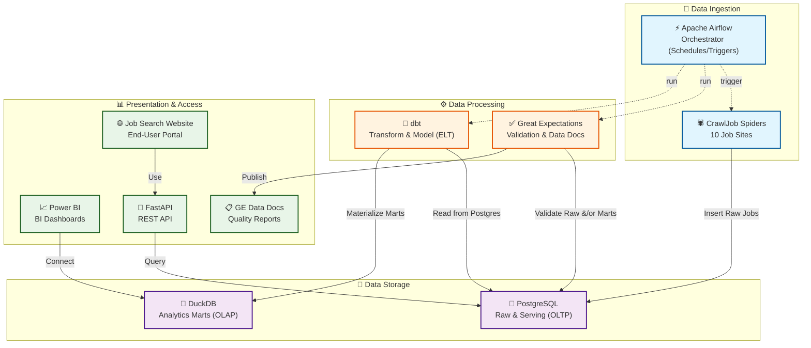
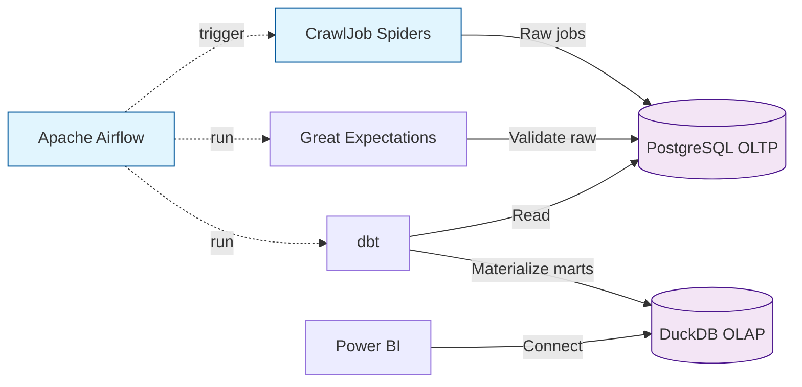
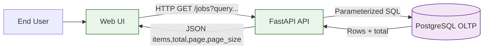
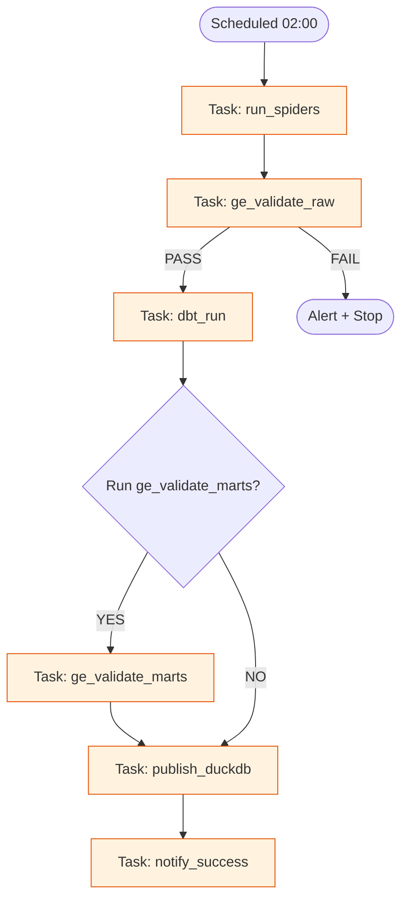
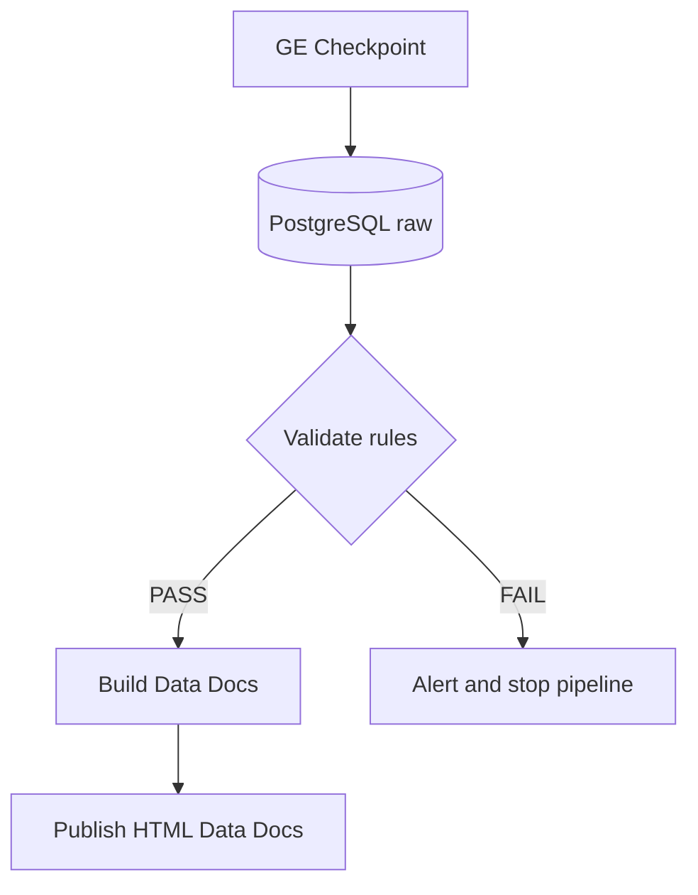
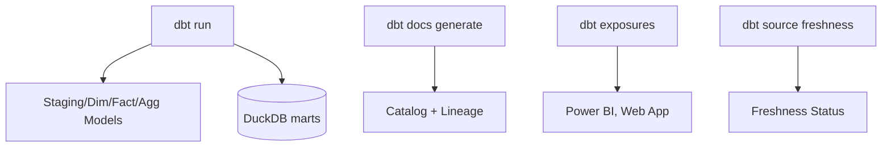
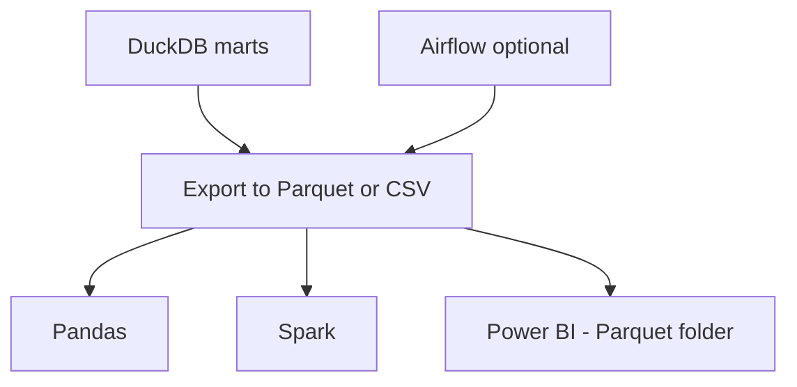

# 🚀 **DATA ENGINEERING STACK IMPLEMENTATION PLAN**
## **CrawlJob: Professional Data Engineering Project**

---

## 📋 **TABLE OF CONTENTS**

1. [🎯 Project Overview](#-project-overview)
2. [🏗️ Architecture Design](#️-architecture-design)

---

## 🎯 **PROJECT OVERVIEW**

### **Current Status**
- ✅ **10 Spiders** hoạt động hoàn hảo
- ✅ **PostgreSQL** database với 10,000+ records
- ✅ **FastAPI** backend với REST endpoints
- ✅ **Web Dashboard** với Bootstrap 5
- ✅ **Automated daily crawling**

### **Data Engineering Goal**
Chuyển đổi CrawlJob thành **Professional Data Engineering Project** với:
- **Apache Airflow**: Workflow orchestration
- **dbt**: Data transformation layer
- **Great Expectations**: Data quality validation
- **Power BI**: Data visualization và analytics

### **Benefits**
- 🏢 **Professional**: Industry-standard data engineering stack
- 📊 **Advanced Analytics**: Rich dashboards và insights
- 🔧 **Automation**: Fully automated pipelines
- 📈 **Scalability**: Easy to scale as project grows
- 💼 **Career Growth**: Valuable skills for data engineering

---

## 🏗️ **ARCHITECTURE DESIGN**

### **Current Architecture**
```
CrawlJob Spiders → PostgreSQL → FastAPI → Web Dashboard
```

### **Target Data Engineering Architecture**

#### **Detailed Data Flow**



#### Data Flow chi tiết cho Power BI

1) Điều phối theo lịch (Airflow)
- Airflow chạy theo lịch (ví dụ 02:00 hằng ngày) và lần lượt trigger các bước: chạy spiders → kiểm tra chất lượng (GE) → biến đổi dữ liệu (dbt) → cập nhật kho OLAP (DuckDB).

2) Thu thập dữ liệu (Spiders → PostgreSQL)
- Các spiders thu thập dữ liệu từ 10 trang, chuẩn hóa tối thiểu và ghi trực tiếp vào PostgreSQL (schema/raw), kèm timestamps/metadata phục vụ kiểm soát phiên crawl.

3) Kiểm tra chất lượng (Great Expectations – Gate)
- GE chạy trên bảng raw ở PostgreSQL: kiểm tra không null các trường quan trọng, tính duy nhất (job_url), độ mới (posted_date), và khối lượng dữ liệu.
- Nếu FAIL: Airflow dừng pipeline, gửi cảnh báo; dữ liệu OLAP cũ vẫn được giữ nguyên để dashboard Power BI không bị ảnh hưởng.
- Nếu PASS: tiếp tục bước biến đổi. (Tùy chọn) Có thể chạy thêm GE sau-transform để kiểm tra các bảng marts.

4) Biến đổi dữ liệu (dbt – ELT)
- dbt đọc dữ liệu từ PostgreSQL (raw) → tạo các mô hình staging/dim/fact/agg.
- Kết quả được materialize vào DuckDB (OLAP) thành các bảng/khung nhìn analytics-ready.

5) Kho phân tích (DuckDB – OLAP)
- DuckDB lưu trữ các mô hình phục vụ phân tích (ví dụ: dim_companies, fct_jobs, agg_jobs_by_industry…).
- File DuckDB được đặt tại một đường dẫn ổn định để phục vụ kết nối từ Power BI.

6) Kết nối Power BI
- Power BI kết nối tới DuckDB để đọc các bảng phân tích. Tùy chọn kết nối:
    - ODBC Driver của DuckDB (khuyến nghị trên Windows), hoặc
    - Xuất Parquet từ DuckDB và dùng Power BI đọc thư mục Parquet, hoặc
    - (Phương án thay thế) Nếu để marts trong PostgreSQL, Power BI có thể kết nối trực tiếp PostgreSQL.

7) Làm mới dữ liệu (Refresh)
- Desktop: Refresh thủ công để phát triển/kiểm thử.
- Service: Dùng On-premises Data Gateway để đặt lịch refresh sau khi Airflow hoàn tất pipeline (ví dụ 04:00). Dataset trỏ tới cùng nguồn (ODBC/file path/Parquet folder).

8) Trình bày và tiêu thụ
- Power BI sử dụng các bảng trong DuckDB để dựng dashboard (Jobs by Industry, Salary Distribution, Trends…). Người dùng xem dashboard trên Power BI Service/app.

9) Ứng dụng web người dùng (không liên quan Power BI)
- Job Search Website truy cập dữ liệu qua FastAPI → PostgreSQL (OLTP) để phục vụ tra cứu/tìm kiếm theo thời gian thực; không truy vấn DuckDB.



#### Data Flow chi tiết cho Job Search Website

1) Người dùng → Giao diện Web (Frontend)
- Người dùng nhập từ khóa/bộ lọc (keyword, site, location, page, page_size, sort…). Giao diện gửi HTTP request tới FastAPI.

2) Frontend → FastAPI (API Layer)
- Endpoint chính: `GET /jobs` với các query params đã hỗ trợ: `keyword`, `site`, `page`, `page_size` (có thể mở rộng `location`, `sort_by`).
- FastAPI validate tham số, chuẩn hóa, log truy vấn, áp hạn mức page_size an toàn (ví dụ 10–50).

3) FastAPI → PostgreSQL (Query OLTP)
- API dựng câu truy vấn có paginate (LIMIT/OFFSET) và các điều kiện lọc; dùng truy vấn tham số (parameterized) để an toàn.
- Khuyến nghị chỉ mục (indexes): `(job_title)`, `(company_name)`, `(location)`, `(posted_date)`, và `(source_site, posted_date)` để tối ưu lọc/sắp xếp.

4) PostgreSQL → FastAPI (Kết quả)
- PostgreSQL trả về danh sách job chuẩn hóa (18+ fields) cùng tổng số bản ghi (total) nếu có truy vấn đếm.
- FastAPI trả JSON về frontend theo schema: `items`, `total`, `page`, `page_size`.

5) FastAPI → Frontend (Hiển thị)
- Frontend render danh sách việc làm, phân trang/scroll, và hiển thị metadata (source_site, scraped_at, posted_date…).
- Cho trải nghiệm tốt hơn: debounce tìm kiếm, hiển thị loader, giữ state bộ lọc.

6) Tính tươi dữ liệu
- Dữ liệu đọc từ PostgreSQL đã được đi qua pipeline Airflow và cổng GE (chất lượng đạt chuẩn) trước đó.
- Web luôn đọc nguồn OLTP nên không bị phụ thuộc vào DuckDB/BI.

7) Độ tin cậy & Hiệu năng
- Timeout hợp lý tại API (ví dụ 3–5s), retry nhẹ phía frontend; phân trang bắt buộc để bảo vệ DB.
- (Tùy chọn) Cache ngắn hạn tại API (in-memory/ETag) cho truy vấn lặp lại; bật nén (gzip) khi trả JSON.

8) Nhật ký & Giám sát
- Log request/response và thời gian truy vấn (latency) để tối ưu tiếp; theo dõi lỗi 4xx/5xx.



#### Data Flow chi tiết cho Orchestration & Monitoring (Airflow)

1) Lên lịch & điều phối
- Airflow DAG chạy theo cron (ví dụ 02:00). Các task: `run_spiders` → `ge_validate_raw` → `dbt_run` → (tuỳ chọn) `ge_validate_marts` → `publish_duckdb` → `notify_success`.

2) Retry & SLA
- Mỗi task có `retries` và `retry_delay` hợp lý; đặt `sla` để cảnh báo khi quá thời gian.

3) Logging & Artifacts
- Log chi tiết của từng task được lưu vào thư mục logs; artifacts gồm GE Data Docs, file DuckDB mới, và dbt target (manifest/run_results).

4) Alerting
- Kênh cảnh báo: Email/Slack khi task fail/SLA miss. Nội dung đính kèm link log và Data Docs (nếu có).

5) Observability
- Theo dõi trạng thái DAG trên Airflow UI (Gantt/Graph). Ghi nhận metrics (thời gian chạy, tỉ lệ fail) để tối ưu.



#### Data Flow chi tiết cho Data Quality (Great Expectations – chi tiết)

1) Cấu hình
- Khai báo datasource trỏ về PostgreSQL (raw) và (tuỳ chọn) DuckDB (marts). Tạo expectation suites cho các bảng quan trọng.

2) Chạy checkpoint
- Airflow trigger checkpoints: `raw_jobs_checkpoint` trước dbt; `marts_checkpoint` sau dbt (tuỳ chọn). Kết quả gồm pass/fail + thống kê chi tiết.

3) Data Docs
- Tự động build Data Docs (HTML) và lưu ở một vị trí cố định (ví dụ `reports/ge_data_docs/`). Có thể publish lên web nội bộ nếu cần.

4) Gating
- Nếu checkpoint FAIL (ví dụ null/unique/freshness vi phạm), dừng pipeline và gửi alert; không cập nhật DuckDB để giữ dashboard ổn định.



#### Data Flow chi tiết cho dbt Docs & Lineage

1) Sinh tài liệu
- Chạy `dbt docs generate` sau `dbt run` để tạo catalog + lineage diagrams; lưu trong `target/` và (tuỳ chọn) publish nội bộ.

2) Exposures
- Khai báo `exposures` trong dbt để mô tả dashboard Power BI và web app như consumer chính; giúp theo dõi tác động thay đổi.

3) Source Freshness
- Chạy `dbt source freshness` theo lịch để đo độ tươi của nguồn (PostgreSQL/raw), phản hồi vào monitoring/alerting.



#### Data Flow chi tiết cho Data Export/Sharing (Parquet/External)

1) Export từ DuckDB
- Sau `dbt run`, có thể export bảng phân tích từ DuckDB sang Parquet/CSV trong `data/exports/` để chia sẻ cho data science/đối tác.

2) Tích hợp công cụ khác
- Các công cụ như Pandas, Spark, hoặc Power BI (qua Parquet folder) có thể tiêu thụ dữ liệu này mà không cần truy cập trực tiếp DB.

3) Quản trị phiên bản
- Đặt quy tắc đặt tên (kèm timestamp) và dọn dẹp phiên bản cũ bằng job định kỳ để tối ưu dung lượng.



### **Technology Stack**
- **Orchestration**: Apache Airflow
- **OLTP Database**: PostgreSQL
- **OLAP Database**: DuckDB
- **Transformation**: dbt
- **Data Quality**: Great Expectations
- **Visualization**: Power BI
- **Backend**: FastAPI
- **Frontend**: Bootstrap 5
- **Containerization**: Docker
- **Version Control**: Git & GitHub