# Complete Scrapy Flow with Selenium Integration

## 🎯 Luồng hoạt động hoàn chỉnh khi chạy TopCV Spider

### Sơ đồ tổng quan:

```mermaid
graph TD
    subgraph "Phase 1: Startup & Initialization"
        A["`**run_spider.py**<br/>Python script khởi động`"] --> B["`**get_project_settings()**<br/>Load cấu hình Scrapy`"]
        B --> C["`**settings.py**<br/>ITEM_PIPELINES<br/>DOWNLOADER_MIDDLEWARES<br/>SQL_SERVER config`"]
        C --> D["`**Register Components**<br/>- SeleniumMiddleware<br/>- SQLServerPipeline<br/>- CrawljobPipeline`"]
        D --> E["`**Load Spider Modules**<br/>Import topcv_spider.py<br/>Import items.py, utils.py`"]
    end

    subgraph "Phase 2: Spider Instance Creation"
        E --> F["`**TopcvSpider.__init__()**<br/>keyword='data analyst'<br/>allowed_domains=['topcv.vn']`"]
        F --> G["`**SeleniumMiddleware.__init__()**<br/>Chrome driver khởi tạo<br/>Headless mode + stealth config`"]
        G --> H["`**SQLServerPipeline.from_crawler()**<br/>Load DB connection settings`"]
    end

    subgraph "Phase 3: Crawling Process"
        H --> I["`**TopcvSpider.start_requests()**<br/>Generate search URL<br/>yield Request to search page`"]
        I --> J["`**SeleniumMiddleware.process_request()**<br/>Check: spider.name == 'topcv'?`"]
        
        J -->|Yes - TopCV Request| K["`**Selenium WebDriver**<br/>driver.get(url)<br/>Wait for JS rendering<br/>Extract page_source`"]
        J -->|No - Other Spider| L["`**HTTP Downloader**<br/>Standard Scrapy download`"]
        
        K --> M["`**HtmlResponse**<br/>Rendered HTML from Selenium<br/>Ready for parsing`"]
        L --> M
        
        M --> N["`**parse_search_results()**<br/>Extract job URLs<br/>yield Request(job_url)`"]
        N --> O["`**Selenium renders job detail page**<br/>Same process for each job`"]
        O --> P["`**parse_job_detail()**<br/>Extract: title, company, salary<br/>location, deadline, etc.`"]
        
        P --> Q["`**JobItem created**<br/>All fields populated<br/>yield item`"]
    end

    subgraph "Phase 4: Item Processing Pipeline"
        Q --> R["`**CrawljobPipeline.process_item()**<br/>Item passes through<br/>(currently just returns item)`"]
        R --> S["`**SQLServerPipeline.process_item()**<br/>Insert into SQL Server<br/>jobs table`"]
        S --> T["`**Database INSERT**<br/>16 fields including<br/>job_deadline, search_keyword`"]
    end

    subgraph "Phase 5: Shutdown & Cleanup"
        T --> U["`**Spider finished**<br/>All pages crawled<br/>All items processed`"]
        U --> V["`**SQLServerPipeline.close_spider()**<br/>Close DB connection`"]
        V --> W["`**SeleniumMiddleware.spider_closed()**<br/>driver.quit()<br/>Chrome process killed`"]
        W --> X["`**Process complete**<br/>JSON file written<br/>Terminal returns`"]
    end

    style A fill:#e1f5fe
    style K fill:#f3e5f5
    style S fill:#e8f5e8
    style X fill:#fff3e0
```



## 📋 Chi tiết từng bước:

### 1. **Khởi động (run_spider.py)**
```python
# Parse arguments: --spider topcv --keyword "data analyst" --output topcv.json
# Load Scrapy settings
# Register spider instance với CrawlerProcess
```

### 2. **Load cấu hình (settings.py)**
```python
DOWNLOADER_MIDDLEWARES = {
    "CrawlJob.selenium_middleware.SeleniumMiddleware": 543,
}
ITEM_PIPELINES = {
    "CrawlJob.pipelines.CrawljobPipeline": 300,
    "CrawlJob.pipelines.SQLServerPipeline": 400,
}
```

### 3. **Selenium Middleware Setup**
```python
# Chrome driver với stealth options:
# - headless mode
# - fake user agent
# - disable automation flags
```

### 4. **Spider Crawling**
```python
start_requests() → Request("https://www.topcv.vn/tim-viec-lam-data-analyst")
↓
SeleniumMiddleware.process_request() → Selenium renders page
↓
parse_search_results() → Extract job URLs
↓
For each job: Selenium renders → parse_job_detail() → yield JobItem
```

### 5. **Item Pipeline**
```python
JobItem → CrawljobPipeline.process_item() → SQLServerPipeline.process_item()
↓
INSERT INTO jobs (job_title, company_name, salary, ..., job_deadline, ...)
```

### 6. **Cleanup**
```python
# Close database connections
# Quit Selenium driver
# Save JSON output file
```

---

## 🔄 **Selenium vs Normal HTTP Flow Comparison**

| Step | Normal HTTP | With Selenium |
|------|-------------|---------------|
| Request | `requests.get(url)` | `driver.get(url)` |
| Rendering | Static HTML only | Full JavaScript rendering |
| Wait time | Instant | 3-5 seconds for JS |
| Anti-bot | Often blocked (403) | Harder to detect |
| Resource usage | Low | High (Chrome process) |
| Success rate | Low for TopCV | Higher bypass rate |

---

## ⚡ **Key Benefits của Selenium Integration**

1. **Bypass JavaScript rendering**: TopCV dùng JS để load job listings
2. **Anti-bot evasion**: Chrome driver khó phát hiện hơn HTTP requests
3. **Dynamic content**: Wait cho elements load trước khi parse
4. **Realistic behavior**: Giống user thật browse website

## 🎯 **Files được sử dụng trong luồng**

| File | Role | Khi nào được gọi |
|------|------|------------------|
| `run_spider.py` | Entry point | Đầu tiên - khởi động |
| `settings.py` | Configuration | Scrapy init - load config |
| `selenium_middleware.py` | Request processor | Mỗi request đến TopCV |
| `topcv_spider.py` | Data extractor | Parse search + job pages |
| `items.py` | Data structure | Khi spider yield item |
| `pipelines.py` | Data processor | Sau khi item được yield |
| `utils.py` | Helper functions | Khi cần encode/clean data |
